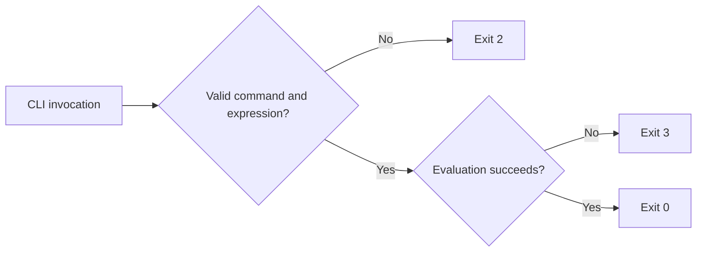

The CLI keeps successful values and diagnostics on separate streams so scripts can consume results without parsing labels or error messages.

## Standard output and standard error

| Stream | Contains |
|:--|:--|
| Standard output | Evaluation results, one result per `run` row, validation confirmation, inspection documents, help, and versions. |
| Standard error | Option and input errors, validation diagnostics, evaluation failures, and unexpected failures. |

A successful `evaluate` writes exactly one formatted value followed by a newline. A successful `run` writes zero or more formatted values. Compact output occupies one line per result; `--output-style pretty` can span several lines. Neither command adds a `Result:` label.

Keep both streams separate when consuming JSON, YAML, or result lines, and check the exit status before trusting captured standard output.

## Exit codes

| Code | Meaning |
|:--|:--|
| `0` | The command completed successfully. |
| `1` | An unexpected internal error occurred. |
| `2` | The expression, invocation, option, input, or source is invalid. |
| `3` | The expression compiled successfully but failed during evaluation. |

The distinction between codes `2` and `3` is useful in data pipelines:



Treat exit code `1` as a tool or infrastructure failure, `2` as an actionable configuration or input failure, and `3` as a runtime expression or data failure.

## Capture a result in PowerShell

```powershell
$output = & expressif evaluate 'absolute | add(5)' --input -12
$status = $LASTEXITCODE

if ($status -ne 0) {
    throw "Expressif failed with exit code $status"
}

$value = $output -join [Environment]::NewLine
```

## Distinguish outcomes in PowerShell

```powershell
& expressif validate $expression

switch ($LASTEXITCODE) {
    0 { Write-Host 'Expression is valid.' }
    1 { throw 'Expressif encountered an unexpected internal error.' }
    2 { throw 'Expression or command input is invalid.' }
    3 { throw 'Expression evaluation failed.' }
    default { throw "Unexpected Expressif exit code $LASTEXITCODE." }
}
```

## Capture a result in Bash

```bash
if result="$(expressif evaluate 'absolute | add(5)' --input -12)"; then
  printf '%s\n' "$result"
else
  status=$?
  printf 'expressif failed: %s\n' "$status" >&2
  exit "$status"
fi
```

## Diagnostics and color

Diagnostics use identifiers for broad failure classes:

| Identifier | Class |
|:--|:--|
| `EXPR1001` | Syntax error. |
| `EXPR2001` | Binding error. |
| `EXPR3001` | Evaluation error. |
| `EXPR4001` | Row-aware runtime error. |

Diagnostic color is enabled only when standard error is attached to a terminal. It is disabled when error output is redirected, `NO_COLOR` is defined, or `TERM=dumb`.

Automation should make decisions from exit codes, not diagnostic wording or ANSI color.

## Shell quoting

The host shell parses an expression before Expressif receives it.

| Shell | Preferred form |
|:--|:--|
| PowerShell | Use single quotes when the expression contains double-quoted text literals. |
| Bash | Use single quotes where possible. |
| `cmd.exe` | Use double quotes. |

For example:

```bash
expressif evaluate 'absolute | add(5)' --input -12
```

If quoting may have changed the expression, inspect the exact received text and spans:

```bash
expressif parse '5 | add(3)' --output json
```

## Reliable pipeline practices

- Pin the `Expressif-cli` package version for reproducible builds.
- Log `expressif version` at the start of a job.
- Keep standard output and standard error separate.
- Check the exit code before consuming output.
- Set `NO_COLOR=1` when logs must never contain escape sequences.
- Use `validate` for compile-time gates and `evaluate` or `run` for data-dependent tests.
