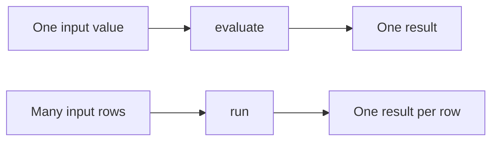

The Expressif CLI brings expression evaluation, data processing, validation, and diagnostics to a terminal or automation workflow.

Every command starts with `expressif`:

```bash
expressif <command> [arguments] [options]
```

## Choose a command

| Command | Use it to |
|:--|:--|
| `evaluate` | Evaluate an expression once, with no input, one explicit value, or one complete source. |
| `run` | Evaluate an expression once for every row produced by an input source. |
| `validate` | Parse, bind, and compile an expression without evaluating it. |
| `parse` | Inspect how the source text forms a syntax tree. |
| `bind` | Inspect the functions, parameters, and expression form resolved after parsing. |
| `help` | List functions or show documentation for a function. |
| `version` | Display the CLI and Expressif library versions. |

The important distinction is between `evaluate` and `run`:



With `evaluate --source`, every row is collected into one array and the expression is evaluated once. With `run --source`, rows remain separate and the expression is evaluated for each one.

## Get command help

```bash
expressif --help
expressif evaluate --help
expressif run --help
```

Use these pages to move from installation to interactive use and then to reliable automation:

1. [Install the CLI](installation.md).
2. [Evaluate an expression once](evaluate-expression.md).
3. [Run expressions over input data](run-input-data.md).
4. [Validate expressions](validate-expressions.md).
5. [Inspect parsing and binding](inspect-expressions.md).
6. [Use the CLI in automation](automation.md).
