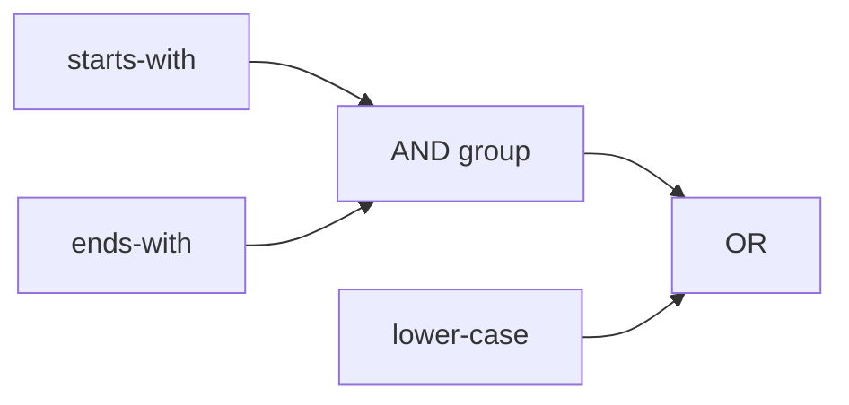

`PredicationBuilder` composes a Boolean rule from predicate types. Start the rule with `Create<T>()` or `Not<T>()`, add combinations, and call `Build()` to obtain an executable predicate.

## Start a rule

<!-- START INCLUDE "PredicationBuilderTest.cs/Chain_WithParameter_CorrectlyEvaluate" -->
```csharp
var builder = new PredicationBuilder()
    .Create<StartsWith>("Nik");

var predicate = builder.Build();
Assert.That(predicate.Evaluate("Nikola Tesla"), Is.True);
```
<!-- END INCLUDE -->

Use `Not<T>()` instead of `Create<T>()` when the first predicate must be negated.

## Combine predicates

Append predicates with `And<T>()`, `Or<T>()`, and `Xor<T>()`:

<!-- START INCLUDE "PredicationBuilderTest.cs/AndOrXor_Generic_CorrectlyEvaluate" -->
```csharp
var builder = new PredicationBuilder()
    .Create<StartsWith>("ola")
    .Or<EndsWith>("sla")
    .And<SortedAfter>("Alan Turing")
    .Xor<SortedBefore>("Marie Curie");

var predicate = builder.Build();
Assert.That(predicate.Evaluate("Nikola Tesla"), Is.True);
```
<!-- END INCLUDE -->

The fluent call order defines the combination order. For mixed operators, extract a grouped subrule so the intended logic remains visible.

## Negate a combined predicate

Use `AndNot<T>()`, `OrNot<T>()`, or `XorNot<T>()`:

<!-- START INCLUDE "PredicationBuilderTest.cs/Chain_NegateGenericFluent_CorrectlyEvaluate" -->
```csharp
var builder = new PredicationBuilder()
    .Create<StartsWith>("ola")
    .OrNot<EndsWith>("Tes");

var predicate = builder.Build();
Assert.That(predicate.Evaluate("Nikola Tesla"), Is.True);
```
<!-- END INCLUDE -->

## Group a subrule

Build a subrule and pass it to `And(...)`, `Or(...)`, or `Xor(...)`. The subrule becomes a group:


<!-- START INCLUDE "PredicationBuilderTest.cs/Serialize_SubPredication_CorrectlySerialized" -->
```csharp
var name = new PredicationBuilder()
    .Create<StartsWith>("Nik")
    .And<EndsWith>("sla");

var builder = new PredicationBuilder()
    .Create<LowerCase>()
    .Or(name)
    .Or<UpperCase>();

var source = builder.Serialize();
Assert.That(source, Is.EqualTo(
    "{{lower-case |OR {starts-with(Nik) |AND ends-with(sla)}} |OR upper-case}"
));
```
<!-- END INCLUDE -->




## Read parameters from a context

As with `ExpressionBuilder`, parameter expressions can read variables and the current object from an `IContext`:

```csharp
var context = new Context();
context.Variables.Add<string>("prefix", "Nik");

var builder = new PredicationBuilder(context)
    .Create<StartsWith>(ctx => ctx.Variables["prefix"]);

var predicate = builder.Build();
```

Context parameter expressions are resolved during evaluation, so a shared context can supply changing values to a reusable predicate.
