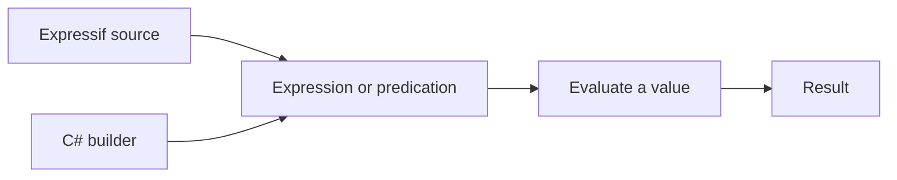

The Expressif .NET SDK brings expression and predication evaluation into a .NET application.

Use the language when rules should remain readable as text. Use the builders when C# code should select and compose the operations. Both approaches produce executable objects that accept a value and return a result.



## Choose an API

| API | Use it to |
|:--|:--|
| `Expression` | Parse an open expression and evaluate it with an incoming value. |
| `Predication` | Parse a predicate or predicate combination and evaluate it as a Boolean rule. |
| `ExpressionBuilder` | Compose a function pipeline with C# types. |
| `PredicationBuilder` | Compose predicates, negation, and Boolean operators with C# types. |
| `Context` | Supply variables and a current object used by an expression or builder. |

## A first evaluation

```csharp
using Expressif;

var expression = Expression.Create("trim | upper");
var result = expression.Evaluate("  Alice  ");
```

The value flows through the same pipeline described in the [Expressif language](../language/index.md):


## What to read next

1. [Install Expressif](installation.md).
2. [Evaluate an expression](evaluate-expression.md).
3. [Evaluate a predication](evaluate-predication.md).
4. [Build an expression with C#](build-expression.md).
5. [Build a predication with C#](build-predication.md).
6. [Serialize a builder](serialization.md).
