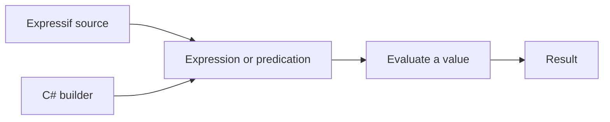

The Expressif .NET SDK brings expression and predication evaluation into a .NET application.

Use the language when rules should remain readable as text. Use the builders when C# code should select and compose the operations. Both approaches produce executable objects that accept a value and return a result.


```mermaid
flowchart LR
    A[Expressif source] --> C[Expression or predication]
    B[C# builder] --> C
    C --> D[Evaluate a value]
    D --> E[Result]
```

## Choose an API

| API | Use it to |
|:--|:--|
| `ExpressifEnvironment` | Select the immutable library set and create expressions, predications, factories, and builders. |
| `IExpression` | Evaluate a parsed expression with an incoming value. |
| `Predication` | Evaluate a parsed predicate or predicate combination as a Boolean rule. |
| `ExpressionBuilder` | Compose a function pipeline with C# types; create it from an environment. |
| `PredicationBuilder` | Compose predicates, negation, and Boolean operators with C# types; create it from an environment. |
| `SemanticAnalyzer` | Locate field-reference input and enclosing scopes without evaluation. |
| `EvaluationContext` | Supply immutable variables to a reusable expression or predication at evaluation time. |

## A first evaluation

```csharp
using Expressif.Hosting;

var environment = ExpressifEnvironment.Default;
var expression = environment.CreateExpression("trim | upper");
var result = expression.Evaluate("  Alice  ");
```

The value flows through the same pipeline described in the [Expressif language](../language/index.md):


```mermaid
flowchart LR
    A["  Alice  "] --> B[trim]
    B --> C[upper]
    C --> D[ALICE]
```

## What to read next

1. [Install Expressif](installation.md).
2. [Evaluate an expression](evaluate-expression.md).
3. [Evaluate a predication](evaluate-predication.md).
4. [Build an expression with C#](build-expression.md).
5. [Build a predication with C#](build-predication.md).
6. [Serialize a builder](serialization.md).
7. [Load runtime libraries](runtime-libraries.md).
8. [Analyze field scopes](semantic-analysis.md).
9. [Migrate an application from v2 to v3](migrate-v2-to-v3.md).
10. [Migrate incremental aggregations to v3](migrate-incremental-aggregations.md).
