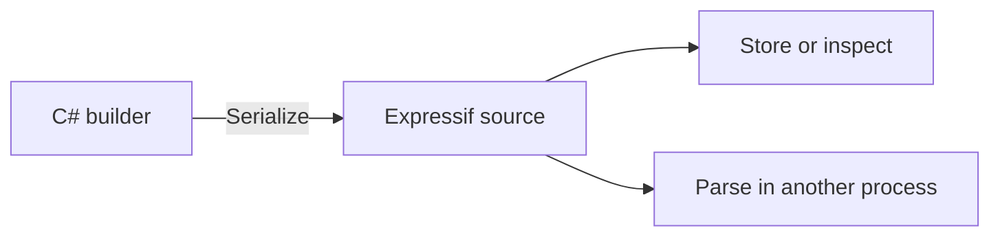

`Serialize()` converts a programmatically composed builder into Expressif source. This is useful for displaying, logging, storing, or exchanging the rule in the language's portable text form.



## Serialize an expression builder

<!-- START INCLUDE "ExpressionBuilderTest.cs/Serialize_WithParameters_CorrectlySerialized" -->
```csharp
var builder = new ExpressionBuilder()
    .Chain<Lower>()
    .Chain<FirstChars>(5)
    .Chain<PadRight>(7, '*');

var source = builder.Serialize();
Assert.That(source, Is.EqualTo(
    "lower | first-chars(5) | pad-right(7, *)"
));
```
<!-- END INCLUDE -->

## Serialize a predication builder

<!-- START INCLUDE "PredicationBuilderTest.cs/Serialize_Negate_CorrectlySerialized" -->
```csharp
var builder = new PredicationBuilder()
    .Create<StartsWith>("ola")
    .OrNot<EndsWith>("sla");

var source = builder.Serialize();
Assert.That(source, Is.EqualTo(
    "{starts-with(ola) |OR !{ends-with(sla)}}"
));
```
<!-- END INCLUDE -->

The serializer includes the grouping required to preserve the builder's Boolean structure.

## Serialize before building

`ExpressionBuilder.Build()` consumes its queued pipeline. When both source and an executable expression are required, serialize first:

```csharp
var builder = new ExpressionBuilder()
    .Chain<Lower>()
    .Chain<Length>();

var source = builder.Serialize();
var expression = builder.Build();
```

An empty builder cannot be serialized or built. `PredicationBuilder` does not consume its rule when built, but serializing first is still a clear and consistent lifecycle.

Serialization preserves the Expressif rule, not the surrounding runtime state. Values supplied by `Context`, delegates, services, or application configuration must be persisted separately if another process needs them.
