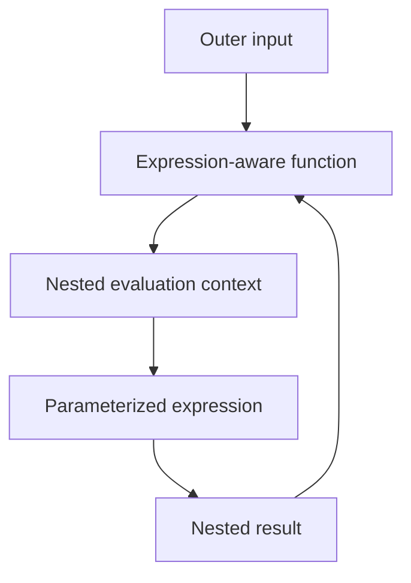
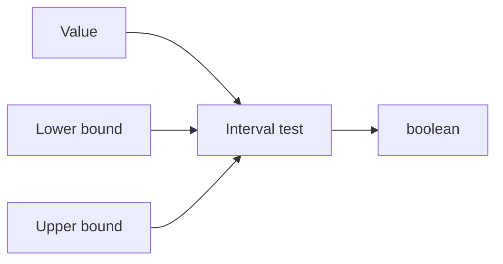
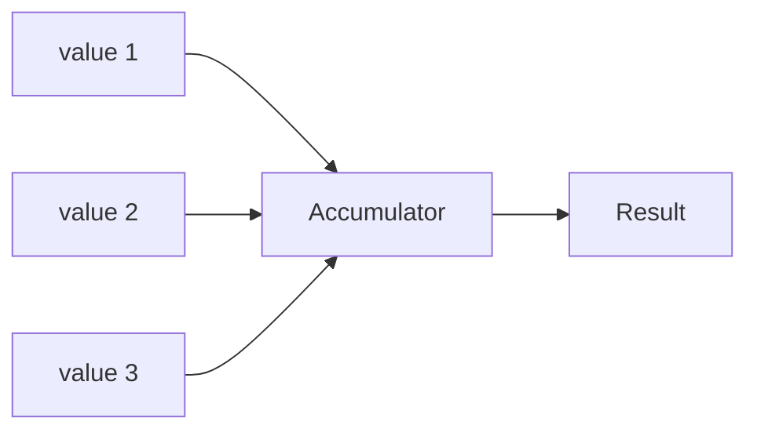
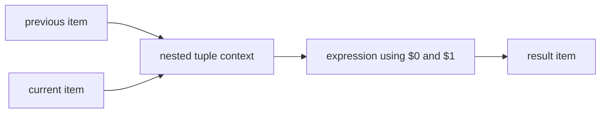
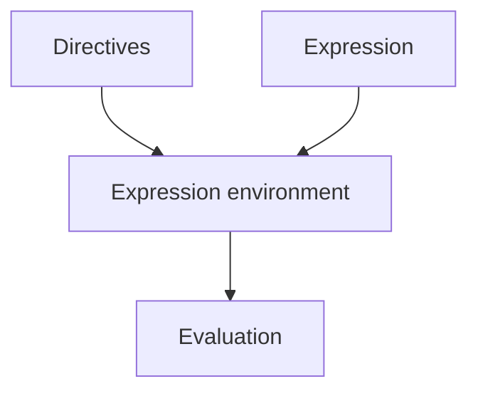

Once you are comfortable with pipelines, functions, references, and collections, several language features make larger expressions more expressive without abandoning the same value-flow model.

## Parameterized expressions

Some functions receive expressions as parameters.

You already encounter this with:

```expressif
filter(.active)
map(.amount)
```

More advanced functions can accept expressions that receive several contextual values or expose more specialized input.

The key question is always:

> What value or values will this nested expression receive when the function evaluates it?

That supplied value becomes the nested expression's input/root. Within one expression, pipeline stages change the current value without changing that root. A nested expression creates a new boundary: `^` refers to its input, not to the input of the outer expression.

For example, in `map(.value | upper | ^.label)`, `.value` and `upper` change the current value, while `^.label` reads `label` from the collection item that entered the nested expression.



Understanding that context is more important than memorizing individual syntax patterns.

## Named arguments

Named arguments bind a value or expression to a parameter by name.

Conceptually:

```expressif
function(
    mode:="strict",
    value:=@threshold
)
```

They are useful when:

- there are several optional parameters;
- positional arguments would be difficult to read;
- different argument kinds are mixed;
- you want the expression to remain stable when optional parameters are added.

Named arguments can be values or expressions where the parameter contract allows it.

## Array spread arguments

Spread arguments are currently supported only by the `array` function. Prefix an array value with `...` to expand its elements in place:

```expressif
array(1, ...@values, 4)
```

If `@values` contains `{2, 3}`, the result is `{1, 2, 3, 4}`. The spread value must be an array; `#null`, text, numeric, and other scalar values cannot be spread.

Array literals support the same operation:

```expressif
{1, ...{2, 3}, 4}
```

Other functions do not accept spread arguments. For example, `add(...@values)` is invalid.

## The incoming value: `...`

The standalone `...` expression represents the complete incoming value. Inside `array(...)`, it expands the incoming array:

```expressif
@values
| array(0, ..., 4)
```

If `@values` contains `{1, 2, 3}`, the result is `{0, 1, 2, 3, 4}`.

Inside `record(...)`, `...` has two position-dependent uses. As an independent entry, it spreads the fields of the incoming record into the new record:

```expressif
record(
    ...,
    processed:=#true
)
```

On the right side of `:=`, it stores the complete incoming value without expanding it:

```expressif
record(
    original:=...,
    processed:=#true
)
```

Record handling of `...` is specific to record construction; it is not support for general spread arguments.

## The variadic `array` function

The `array` function accepts a variable number of arguments:

```expressif
array(1, 2, 3)
```

or:

```expressif
array(
    record(year:=2024, total:=10),
    record(year:=2025, total:=12),
    record(year:=2026, total:=15)
)
```

This is useful when values are computed expressions rather than literals that can conveniently be placed in array literal syntax.

## Intervals

Intervals describe ranges of values.

They are useful when a condition is better expressed as membership in a range than as two unrelated comparisons.

Conceptually:

```text
value ∈ interval
```



Interval syntax should make inclusiveness, exclusiveness, and unbounded ends visible.

Use interval expressions when they make the rule easier to inspect than combining several comparison operators manually.

## Fold

A fold reduces a collection by repeatedly combining values.

Conceptually:



A function such as `sum` is a familiar specialized accumulator.

A more general fold allows the reduction behavior itself to be expressed.

The important distinction is:

- `map` preserves the number of elements;
- `filter` preserves the element type but may reduce the number of elements;
- `fold` reduces a collection into an accumulated result.

## Scan

A scan is related to fold but keeps intermediate accumulated values.

Conceptually:

```text
input values
→ successive accumulator states
→ array of states
```

This is useful when the evolution of the aggregate matters, not only the final result.

## Adjacent values and windows

Functions such as `adjacent` expose neighboring values to a nested expression.

A pair can be represented positionally:

```expressif
$0
$1
```

Positions are zero-based: `$0` is the previous item and `$1` is the current item.

For example:

```expressif
adjacent(
    record(
        year:=$1.year,
        percentage:=($1.total - $0.total) / $0.total * 100
    )
)
```



This avoids writing explicit index arithmetic for many sequence problems.

## Namespaces and imports

As the function catalog grows, namespaces can organize functions and avoid ambiguity.

A qualified name can make ownership explicit:

```expressif
numeric::arithmetic::multiply
```

Import or alias syntax can then reduce repetition where appropriate.

The goal is discoverability and disambiguation, not forcing every common function call to become verbose.

## Directives and schemas

Language directives can provide information that is not part of the value transformation itself.

Examples include:

- imports;
- provider selection;
- input schema;
- output expectations;
- other evaluation metadata.

Conceptually:



Keep that distinction clear:

> directives configure how an expression is understood or evaluated; the expression describes the value transformation.

## Advanced does not mean different

All these features still follow the same core rules:

```text
values flow
functions compose
expressions produce values
nested expressions receive a defined context
```

When an advanced expression becomes hard to read, return to those principles and expand the shorthand or nesting until the data flow is visible again.
