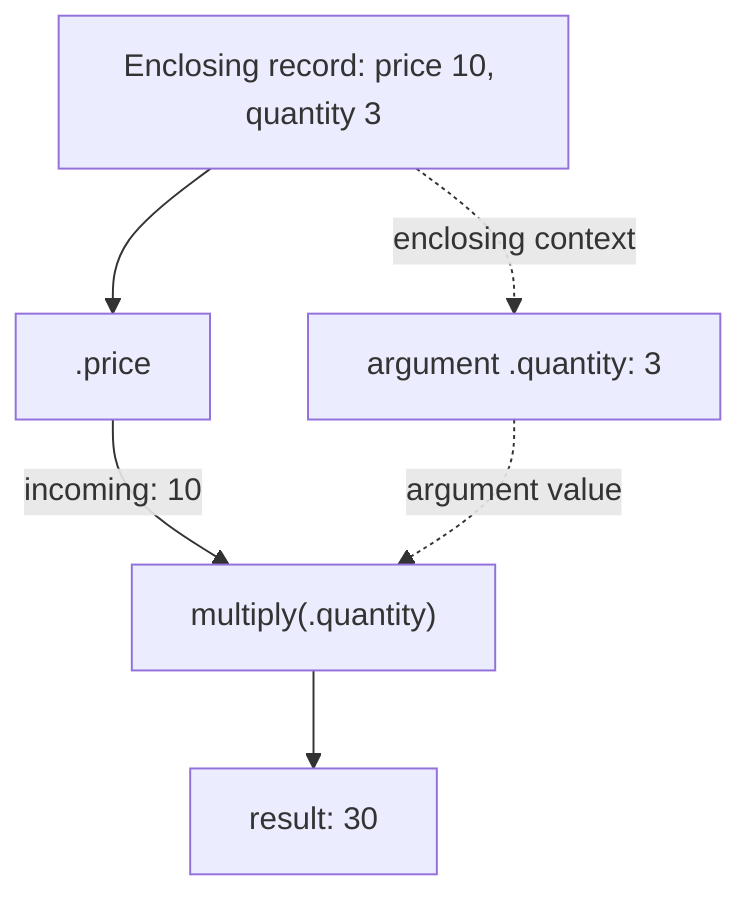
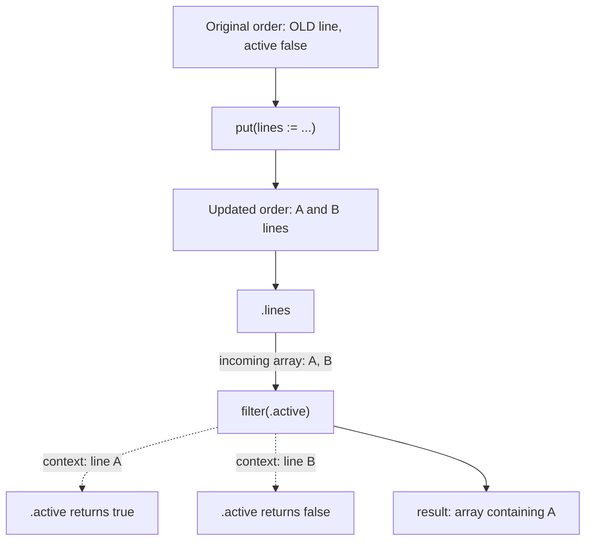
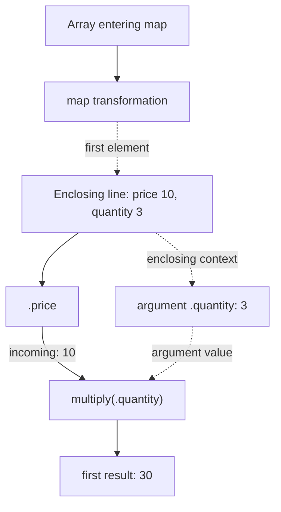

These two expressions both read naturally. The first calculates a line total from its price and quantity:


```expressif
{price := 10, quantity := 3}
| .price
| multiply(.quantity)
```


The result is `30`.

The second replaces an order's lines and keeps the active ones:


```expressif
{
    active := #false,
    lines := {{sku := "OLD", active := #true}}
}
| put(lines := {
    {sku := "A", active := #true},
    {sku := "B", active := #false}
})
| .lines
| filter(.active)
```


Only line `A` remains. Line `OLD` was replaced, and line `B` is inactive. The order's own `active := #false` does not control the filter.

Here the field update is written `put(...)`. It returns a record, so `.lines` selects the array that `filter` needs.

Both calls have a field reference inside their parentheses. Yet **`multiply(.quantity)` reads a field from the enclosing record, while `filter(.active)` reads a field from each line in the array entering that filter call**. The parameter's context explains the difference.

## Two questions to ask at every call

**Incoming** is the value entering this specific function call. In a pipeline, it is the result of the previous step.

**Enclosing** is the context available where the call occurs. An argument that uses this context can read its fields even when the pipeline has moved on to a number or text value.

Ask these two questions separately:

1. What value is entering the function?
2. Which value does the argument expression read?

The answers can be the same, but they do not have to be. In the diagrams below, solid arrows show the pipeline; dotted arrows show how an argument gets its context.

## Multiplication: the price arrives, the quantity comes from the record

In the first example, `.price` is a pipeline step. It reads the record and produces `10`. That number is the incoming value for `multiply`.

The argument `.quantity` is evaluated using the enclosing record, where it reads `3`. `multiply` combines those two numbers and returns `30`.



The same dot notation appears in two different positions:

| Position | What it reads in this example |
|:--|:--|
| `.price` as a pipeline step | The record arriving at that step. |
| `.quantity` as the argument of `multiply` | The enclosing record. |

Reading `.quantity` does not require the incoming number `10` to have a quantity field. The parameter tells Expressif where to evaluate that argument.

## Filtering: each line becomes the predicate's context

In the second example, `put` creates an updated record containing lines `A` and `B`. `.lines` then produces the updated array. **That array is the incoming value for `filter`**.

The `predicate` parameter selects each array element. Expressif evaluates `.active` against line `A`, then against line `B`. Each line becomes the context for its own predicate evaluation.



The filter uses the array arriving at **this call**, including changes made earlier in the pipeline. Its predicate does not read the order's `active` field or inspect the old lines array.

`put` also has an argument context: its assignment expressions use the complete record entering that `put` call. In this example the assignment is a literal array, so it does not need to read any fields from that record.

## Read the source and selection together

The parameter documentation names both a **source** and a **selection**. The source identifies the value to start from. The selection identifies which part supplies the argument's context.

| Parameter | Source | Selection | Meaning |
|:--|:--|:--|:--|
| `multiply.value` | `enclosing` | `self` | Read from the enclosing context as a whole. |
| `put.assignments` | `incoming` | `self` | Evaluate assignments against the record entering `put`. |
| `filter.predicate` | `incoming` | `array-element` | Evaluate the predicate against each element of the array entering `filter`. |
| `map.transformation` | `incoming` | `array-element` | Evaluate the transformation against each element of the array entering `map`. |

`self` does not mean “the original document,” and `array-element` does not mean “an element of any surrounding array.” Both are relative to the named source at that particular call.

Other selections are `group` for a whole group, `group-values` for a group's entire value collection, and `leaf` for each recursively reached leaf. `custom` marks a context that needs an operator-specific explanation, such as the accumulated value and current element supplied together by `reduce`.

## Enclosing can mean one array element

An enclosing context is not necessarily the outermost record. Consider an order with a quantity of `100` and two lines with their own quantities:


```expressif
{
    quantity := 100,
    lines := {
        {price := 10, quantity := 3},
        {price := 8, quantity := 2}
    }
}
| .lines
| map(.price | multiply(.quantity))
```


The result is `{30, 16}`.

`map` establishes each line as the context of its transformation. Inside that transformation, `multiply` uses the line as its enclosing context. It reads quantities `3` and `2`; it does not read the order's quantity of `100`.



The second line follows the same steps: incoming price `8`, argument quantity `2`, result `16`.

Filtering can contain the same calculation:


```expressif
{
    {price := 10, quantity := 3},
    {price := 8, quantity := 2}
}
| filter(.price | multiply(.quantity) | greater-than(20))
```


Only the first line remains. For that line, `multiply` receives `10` and produces `30`; `greater-than` then receives `30` and compares it with `20`. The literal `20` does not read the enclosing context. The predicate's result is `true`, so `filter` keeps the original line record.

## Updating the incoming value does not replace the enclosing context

This difference also matters after a record update:


```expressif
{price := 10, quantity := 3}
| put(quantity := 4)
| .price
| multiply(.quantity)
```


The result is **`30`**. `put` returns a record with quantity `4`, and `.price` reads `10` from that updated record. But `.quantity`, as an argument of `multiply`, still reads `3` from the enclosing record.

To calculate using the updated record as the context, start a nested expression with `apply`:


```expressif
{price := 10, quantity := 3}
| put(quantity := 4)
| apply(.price | multiply(.quantity))
```


Now the result is **`40`**. The expression parameter of `apply` uses `incoming` with selection `self`: the updated record becomes the context of the nested expression. Inside it, `.quantity` reads `4`.

| Calculation | Incoming value for `multiply` | Enclosing quantity | Result |
|:--|:--|:--|:--|
| Directly after the update and `.price` | `10` | `3` | `30` |
| Inside `apply` after the update | `10` | `4` | `40` |

When a field reference is surprising, locate the call containing it, check that parameter's source and selection, and name the concrete value they identify. For nested expressions, repeat that check at each boundary.

Continue with [References](references.md) for field and root-reference syntax, or [Functions](functions.md) for argument forms and function signatures.
