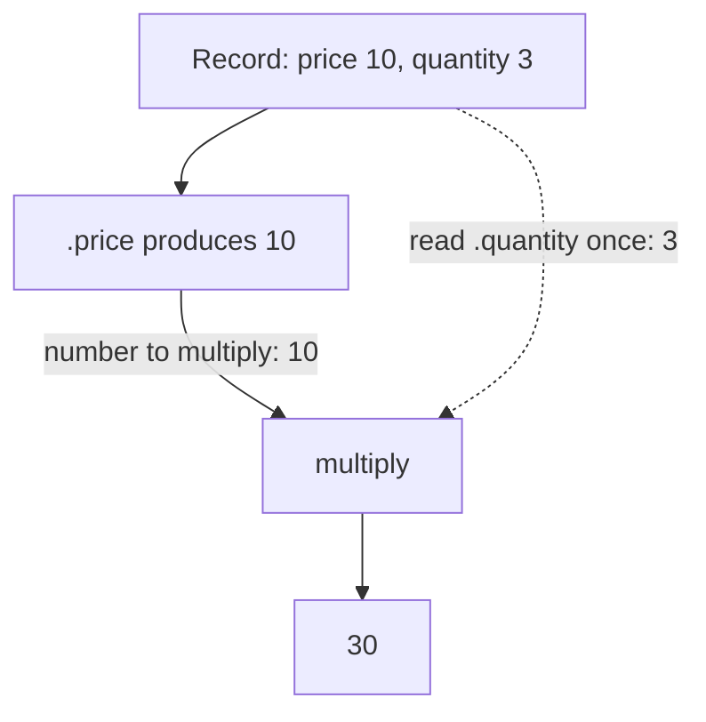
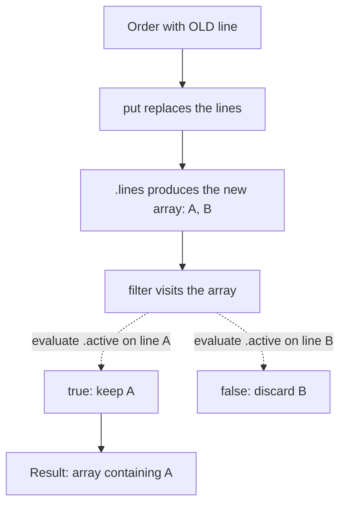

## Two expressions that read naturally

Suppose a record contains a price and a quantity. To calculate its total, take the price and multiply it by the quantity:


```expressif
{price := 10, quantity := 3}
| .price
| multiply(.quantity)
```


Read this as **“take this record's price and multiply it by this record's quantity.”** The result is `30`. You expect `.quantity` to read the record, even though the value reaching `multiply` is now the number `10`.

Now suppose you replace an order's lines and want to keep only the active ones:


```expressif
{
    active := #false,
    lines := {{sku := "OLD", active := #true}}
}
| put(lines := {
    {sku := "A", active := #true},
    {sku := "B", active := #false}
})
| .lines
| filter(.active)
```


Read this as **“replace the lines, then keep the active lines.”** You expect `.active` to read each new line, so only line `A` remains. Reading the order's own `active` field would answer a different question. Using the old lines would ignore the update you just made.

Here, `put` is the field-update function. It returns the updated record; `.lines` selects the array to filter.

These expectations are natural, but they require different argument evaluation:

- `multiply(.quantity)` reads its argument once from the record surrounding the calculation.
- `filter(.active)` visits the array produced by the pipeline and evaluates its argument separately for each line.

Expressif gives functions evaluation rules that support these familiar readings. The aim is to make the vast majority of everyday expressions convenient to write, without making you pass a context explicitly or manage a loop. Usually, you can write the calculation or transformation as you would describe it.

You only need to look more closely when combining contexts in a less usual way, or when an argument reads a value you did not expect. The rules below explain those cases; they also explain why both expressions above work naturally.

## What happens in the two examples

For `multiply`, there is one incoming number and one argument to evaluate. The argument gets its value from the surrounding record:



For `filter`, there is an incoming array to visit. The predicate gets a new context for each visited line:



The solid arrows show the values moving through the pipeline. The dotted arrows show where the arguments are evaluated. **The distinction is between the argument of `multiply` and the predicate of `filter`: one uses the surrounding record, the other uses each visited line.**

## Two sources: incoming and enclosing

**Incoming** is the value entering a particular function call. In the first example, `multiply` receives `10`. In the second, `filter` receives the updated array of lines.

**Enclosing** is the context in which the expression containing the call is being evaluated. In the multiplication example, that is the record containing `price` and `quantity`. Moving along the pipeline to `.price` does not remove that context.

These names are relative to a call. They do not mean “the original document” and “the latest document.” Inside a transformation applied to each line, the enclosing context can be that line.

## Read traversal and evaluation separately

The reference documentation describes two decisions:

- **Traversal belongs to the function:** which values does it visit?
- **Evaluation belongs to each parameter:** when does its expression run, and which context does it use?

### Multiply: evaluate an argument without traversing

`multiply` does not visit a collection. Its `value` parameter has this evaluation information in the catalog:

```json
"Evaluation": {
  "Frequency": "once",
  "Source": "enclosing",
  "Summary": "Evaluated once in the enclosing context."
}
```

For `multiply(.quantity)`, this means: read `.quantity` once from the enclosing record, then multiply the incoming number by that result. There is no traversal selection to specify.

### Filter: traverse the array and evaluate on each element

`filter` declares the values it visits:

```json
"Traversal": {
  "Source": "incoming",
  "Selection": "array-element",
  "Summary": "Visits each element of the array entering this call."
}
```

Its `predicate` parameter then refers to that traversal:

```json
"Evaluation": {
  "Frequency": "per-element",
  "Context": "traversal",
  "Summary": "Evaluated once per visited element, with that element as its context."
}
```

Read these together: visit the elements of the incoming array; for each element, evaluate the predicate with that element as its context. This is why `.active` reads each updated line.

`Selection` belongs to traversal. Besides `array-element`, it can identify a `group`, a group's entire `group-values` collection, or a recursive `leaf`. An argument evaluated once does not need a redundant `self` or `whole` selection.

The `Summary` fields provide the natural sentences displayed in the reference pages. You can read those sentences without reading JSON. `custom` identifies a rule that needs its own explanation, such as evaluating an operation against the accumulated result and the next element together.

### A traversal does not make every argument run for each element

For `closest-by(.price, 25)`, the function visits the incoming array. Its `expression` argument runs for each element to obtain a price. Its `target` argument is evaluated once in the enclosing context, and the resulting `25` is reused throughout the search.

That is why traversal and evaluation are separate declarations: the function describes what it visits, while each parameter describes how it participates.

## These rules also compose naturally

To calculate a total for every line, write the same multiplication inside `map`:


```expressif
{
    quantity := 100,
    lines := {
        {price := 10, quantity := 3},
        {price := 8, quantity := 2}
    }
}
| .lines
| map(.price | multiply(.quantity))
```


The result is `{30, 16}`: **“for each line, multiply its price by its quantity.”**

`map` visits each incoming line and evaluates its transformation in that line's context. Inside the transformation, `multiply` reads its argument from the enclosing line. It therefore reads quantities `3` and `2`, not the order's quantity of `100`. The traversal of `map` and the evaluation rule of `multiply` work together to give the expected result.

## Updating the incoming value does not replace the enclosing context

An explicit record update is one situation where you may need to inspect the rules. Consider:


```expressif
{quantity := 3}
| put(quantity := 4)
| .quantity
| multiply(.quantity)
```


The pipeline reads `4` from the updated record and passes it to `multiply`. But `multiply` still evaluates its argument in the enclosing record, where the quantity is `3`. The result is `4 × 3 = 12`.

If the rest of the calculation should use the updated record as its context, make that choice explicit with `apply`:


```expressif
{quantity := 3}
| put(quantity := 4)
| apply(.quantity | multiply(.quantity))
```


`apply` evaluates its expression against the incoming updated record. Inside that expression, both field references read `4`, producing `16`.

For cases like this, consult the parameter's evaluation description. The source tells you where it reads; the frequency tells you when it runs. Conditional or repeated evaluation is described explicitly rather than implied by the source.

Continue with [References](references.md) for field and root-reference syntax, or [Functions](functions.md) for argument forms and function signatures.
