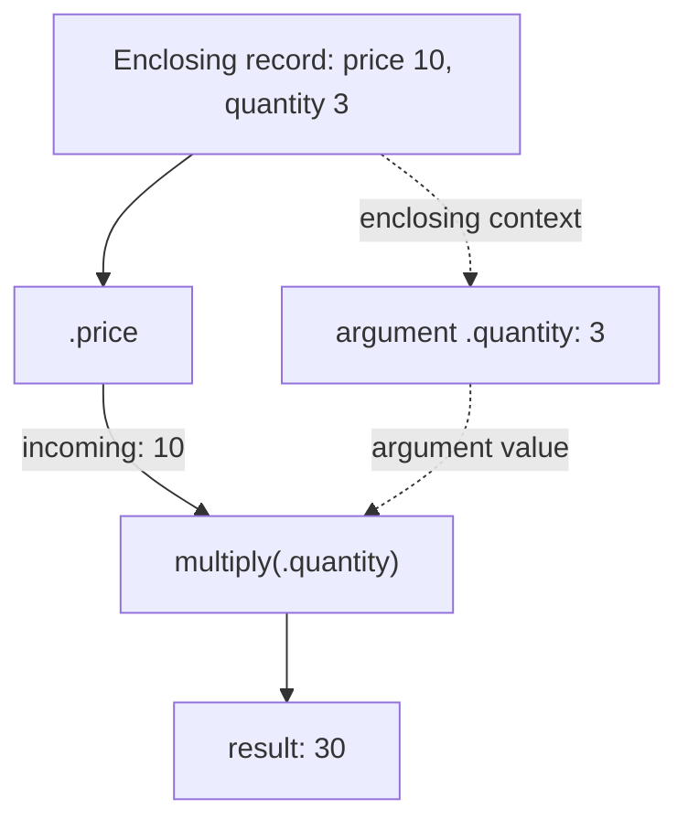
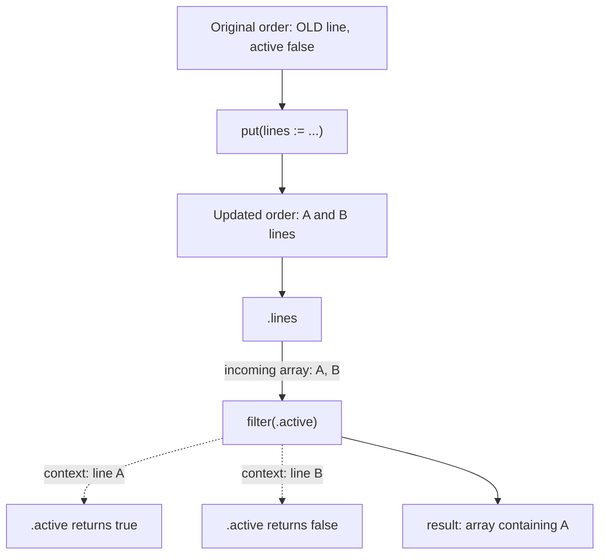
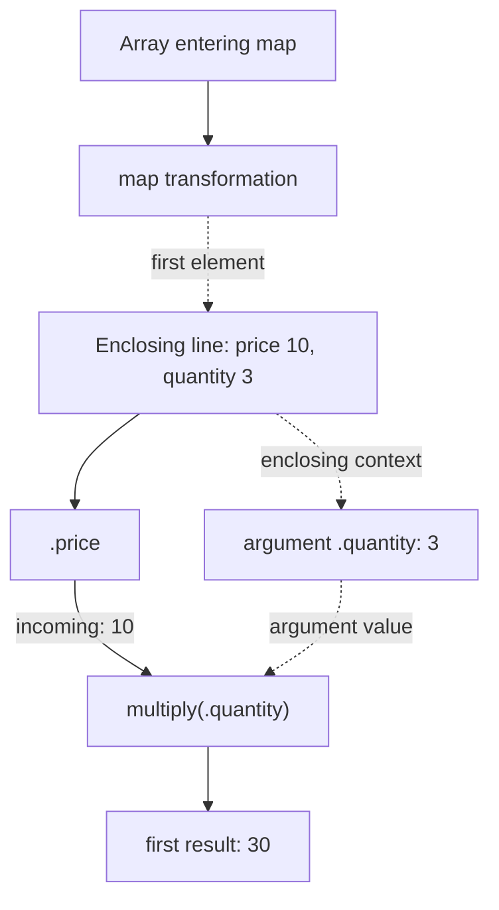

These two expressions both read naturally. The first calculates a line total from its price and quantity:


```expressif
{price := 10, quantity := 3}
| .price
| multiply(.quantity)
```


The result is `30`.

The second replaces an order's lines and keeps the active ones:


```expressif
{
    active := #false,
    lines := {{sku := "OLD", active := #true}}
}
| put(lines := {
    {sku := "A", active := #true},
    {sku := "B", active := #false}
})
| .lines
| filter(.active)
```


Only line `A` remains. Line `OLD` was replaced, and line `B` is inactive. The order's own `active := #false` does not control the filter.

Here the field update is written `put(...)`. It returns a record, so `.lines` selects the array that `filter` needs.

Both calls have a field reference inside their parentheses. Yet **`multiply(.quantity)` reads a field from the enclosing record, while `filter(.active)` reads a field from each line in the array entering that filter call**. The parameter's context explains the difference.

## Two questions to ask at every call

**Incoming** is the value entering this specific function call. In a pipeline, it is the result of the previous step.

**Enclosing** is the context available where the call occurs. An argument that uses this context can read its fields even when the pipeline has moved on to a number or text value.

Ask these two questions separately:

1. What value is entering the function?
2. Which value does the argument expression read?

The answers can be the same, but they do not have to be. In the diagrams below, solid arrows show the pipeline; dotted arrows show how an argument gets its context.

## Multiplication: the price arrives, the quantity comes from the record

In the first example, `.price` reads `10` from the record. That number is passed to `multiply`.

The argument `.quantity` is evaluated using the enclosing record, where it reads `3`. `multiply` combines those two numbers and returns `30`.



Focus on the `multiply` call: it receives **`10` as its incoming value** and reads its argument from **the enclosing record**. Both field references read the original record in this example. To see them read different records, we will [change a field before reading it](#updating-the-incoming-value-does-not-replace-the-enclosing-context).

## Filtering: each line becomes the predicate's context

In the second example, `put` creates an updated record containing lines `A` and `B`. `.lines` then produces the updated array. **That array is the incoming value for `filter`**.

`filter` visits each array element. Expressif evaluates its predicate `.active` against line `A`, then against line `B`. Each line becomes the context for its own predicate evaluation.



The filter uses the array arriving at **this call**, including changes made earlier in the pipeline. Its predicate does not read the order's `active` field or inspect the old lines array.

`put` also has an argument context: its assignment expressions use the complete record entering that `put` call. In this example the assignment is a literal array, so it does not need to read any fields from that record.

## Separate traversal from argument evaluation

The function decides what it visits. The parameter describes when its expression runs and which context it uses.

For `filter`, the function visits each element of its incoming array. Its predicate is evaluated once for each visited element, with that element as its context. For `multiply`, the value argument is evaluated once in the enclosing context; there is no element selection to describe for that argument.

| Parameter | How its expression is evaluated |
|:--|:--|
| `multiply.value` | Once in the enclosing context. |
| `put.assignments` | Each assignment once against the record entering `put`. |
| `filter.predicate` | Once for each element visited by `filter`, using that element as its context. |
| `map.transformation` | Once for each element visited by `map`, using that element as its context. |

An array element always comes from the array entering that particular call. Other traversals visit whole groups, a group's entire value collection, or recursive leaves. These selections belong to the function's traversal, not to arguments evaluated once.

The two kinds of evaluation can occur in the same call. `closest-by(.price, 25)` evaluates `.price` for each incoming array element but evaluates its target once and reuses it throughout the search. The literal `25` does not need to read any context.

Context and frequency are separate facts. An argument that uses the enclosing context is not automatically evaluated once. For example, `divide` evaluates its value argument to check for zero and evaluates it again for division when the first result is nonzero. Read the function's evaluation description for conditional or repeated work.

The catalog keeps these facts structured: `Traversal` identifies a function's source and selection; each parameter's `Evaluation` describes its frequency and context. A once-evaluated argument needs a source, without an extra `self` or `whole` selection. Each declaration also has a `Summary` containing the natural sentence shown in the reference. `custom` marks rules that need a specific explanation, such as the accumulated result and current element supplied together by `reduce`.

## Enclosing can mean one array element

An enclosing context is not necessarily the outermost record. Consider an order with a quantity of `100` and two lines with their own quantities:


```expressif
{
    quantity := 100,
    lines := {
        {price := 10, quantity := 3},
        {price := 8, quantity := 2}
    }
}
| .lines
| map(.price | multiply(.quantity))
```


The result is `{30, 16}`.

`map` establishes each line as the context of its transformation. Inside that transformation, `multiply` uses the line as its enclosing context. It reads quantities `3` and `2`; it does not read the order's quantity of `100`.



The second line follows the same steps: incoming price `8`, argument quantity `2`, result `16`.

Filtering can contain the same calculation:


```expressif
{
    {price := 10, quantity := 3},
    {price := 8, quantity := 2}
}
| filter(.price | multiply(.quantity) | greater-than(20))
```


Only the first line remains. For that line, `multiply` receives `10` and produces `30`; `greater-than` then receives `30` and compares it with `20`. The literal `20` does not read the enclosing context. The predicate's result is `true`, so `filter` keeps the original line record.

## Updating the incoming value does not replace the enclosing context

Now read the same field twice, after changing its value from `3` to `4`:


```expressif
{quantity := 3}
| put(quantity := 4)
| .quantity
| multiply(.quantity)
```


The result is **`12`**, because the two occurrences of `.quantity` read different records:

1. `put` produces an updated record: `{quantity := 4}`.
2. The pipeline step `.quantity` reads that updated record and passes **`4`** to `multiply`.
3. The argument `.quantity` reads the original enclosing record, where the quantity is still **`3`**.
4. `multiply` calculates **`4 × 3 = 12`**.

This is the difference that the first example could not show: a pipeline field access follows the updated value, while this argument keeps reading the enclosing record.

To calculate using the updated record as the context, start a nested expression with `apply`:


```expressif
{quantity := 3}
| put(quantity := 4)
| apply(.quantity | multiply(.quantity))
```


Now the result is **`16`**. `apply` uses the updated record as the context of its nested expression. Both occurrences of `.quantity` read `4`, so the calculation is **`4 × 4 = 16`**.

| Calculation | Incoming value for `multiply` | Enclosing quantity | Result |
|:--|:--|:--|:--|
| Directly after the update and `.quantity` | `4` | `3` | `12` |
| Inside `apply` after the update | `4` | `4` | `16` |

When an argument reads an unexpected value, find the call it belongs to and read that parameter's evaluation description. Identify the actual record, element, or other value used as its context.

Continue with [References](references.md) for field and root-reference syntax, or [Functions](functions.md) for argument forms and function signatures.
