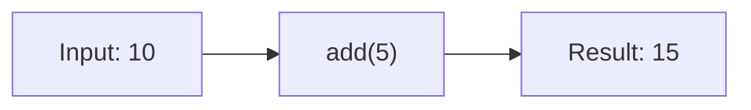
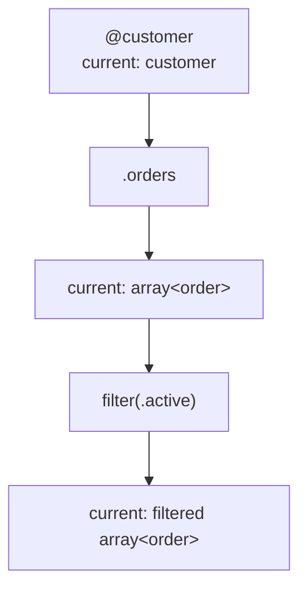
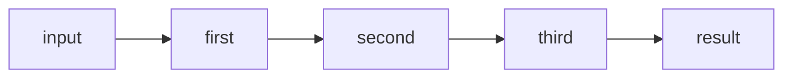
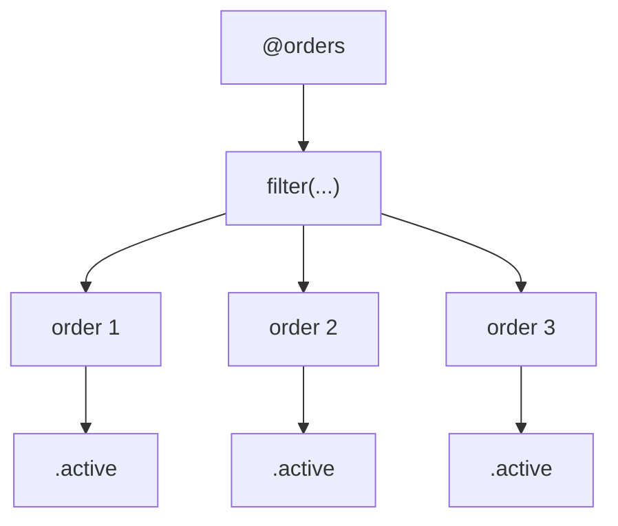
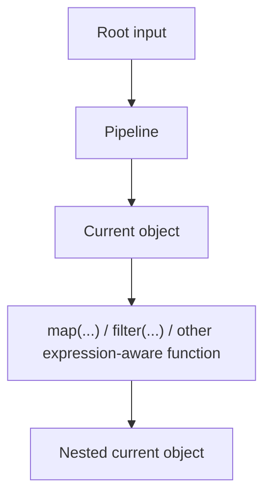

An Expressif expression receives a value, evaluates some logic, and produces a result.

The simplest way to understand the language is to follow the value.

## Input value

The input value is the value supplied when the expression starts.

For example:

```expressif
10 | add(5)
```

If `10` is the value at the start of the expression, `add(5)` receives `10` as its input.



The input can be a scalar, a record, a tuple, an array, or another supported value.

## The current object

During evaluation, the value flowing through the expression is the **current object**.

Consider:

```expressif
@customer
| .orders
| filter(.active)
```

The current object changes after each step.



This matters because field access and nested expressions are evaluated relative to a current value.

## Pipelines

The pipe operator `|` connects expressions.

```expressif
input | first | second | third
```

Each step receives the result of the previous step.



For example:

```expressif
"  Alice  "
| trim
| upper
```

is read from left to right:

1. start with the text;
2. trim it;
3. convert it to upper case.

## A function can use the current object

A function call does not repeat its pipeline input as an argument.

```expressif
10 | add(5)
```

means:

```expressif
input: 10
parameter value: 5
```

It does **not** mean that `add` receives two ordinary arguments `10` and `5`.

This distinction is important when reading function signatures.

## Nested expressions

Functions can receive expressions as arguments.

For example:

```expressif
@orders
| filter(.active)
```

The outer expression is operating on the array of orders.

Inside `filter(...)`, `.active` is evaluated for each order.



The exact evaluation behavior depends on the function, but the principle stays the same: nested expressions receive a context appropriate to the function that evaluates them.

## Root and nested contexts

When expressions become nested, it is useful to distinguish:

- the value originally supplied to the complete expression;
- the value currently flowing through a pipeline;
- the value currently supplied to a nested expression.

These values can be different.



See [References](references.md) for the syntax used to access the different values available to an expression.

## Expressions produce values

Expressif expressions are value-oriented.

A pipeline may produce:

```expressif
text
numeric
boolean
date
record
tuple
array
```

or another supported type.

This is one of the main differences from statement-oriented languages: an expression is primarily something that **has a value**.

## Keep expressions readable

Long expressions are easier to understand when each stage performs one recognizable transformation.

Prefer:

```expressif
@orders
| filter(.active)
| map(.amount)
| sum
```

over trying to compress unrelated transformations into one deeply nested call.

Pipelines are not only syntax. They are the main reading structure of Expressif.
