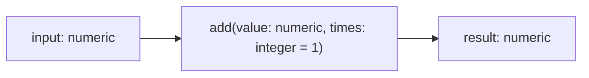
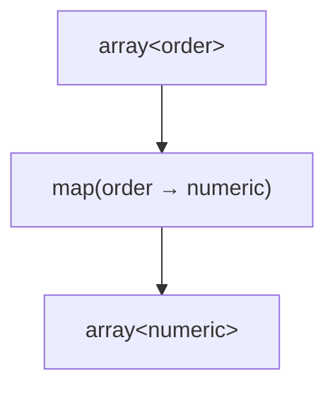
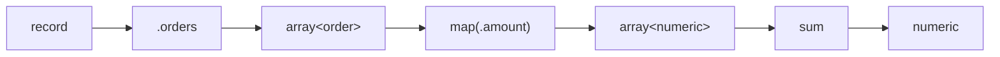

Functions are the main building blocks of Expressif expressions.

A function receives the current input value, optionally receives parameters, and produces a result.

## Input is part of the function call

Consider:

```expressif
10 | add(5)
```

The function receives:

```text
input: 10
parameter value: 5
```

The pipeline input is not written again inside the parentheses.

This is why a function signature is best read as:

```text
numeric →
add(
    value: numeric,
    times: integer = 1
)
→ numeric
```



## Parameters

Parameters configure how a function behaves.

For example:

```expressif
10 | add(5)
```

The parameter `5` tells `add` what to add to the current input.

A function can have several parameters:

```expressif
value | some-function(first, second, third)
```

The function documentation should describe:

- the input type;
- each parameter;
- which parameters are required;
- defaults;
- the return type.

## Positional arguments

The simplest function calls use positional arguments.

```expressif
10 | add(5)
```

The first argument is matched to the first parameter.

When a function has several parameters, argument order matters.

## Named arguments

Named arguments make the parameter explicit.

Conceptually:

```expressif
some-function(
    value:=5,
    mode:="strict"
)
```

Named arguments are useful when:

- a function has several optional parameters;
- argument meaning is not obvious from position;
- you want the expression to remain readable after adding more parameters.

Named arguments are syntax for parameter binding. They do not change the pipeline input.

## Default and optional parameters

A function can define defaults for parameters.

This allows concise calls when the default behavior is appropriate while still allowing explicit configuration when needed.

For example:

```expressif
10 | add(5)
```

can remain short even if `add` supports an additional optional parameter.

The function reference should always show which arguments can be omitted and what defaults are used.

## Functions can receive expressions

Some functions receive an expression to evaluate later.

For example:

```expressif
@orders
| map(.amount)
```

`map` receives `.amount` as a projection expression.

Conceptually:



Likewise:

```expressif
@orders
| filter(.active)
```

passes a predicate expression to `filter`.

This is a major part of Expressif: expressions can be composed not only in pipelines but also as arguments to other functions.

## Functions can change types

A function does not need to return the same type it receives.

Examples:

```text
text → text
text → integer
record → text
array<numeric> → numeric
array<A> → array<B>
```

A pipeline is therefore also a sequence of type transitions.



## Functions, predicates, and accumulators

From a user's perspective, these concepts share the same composition model.

A transformation:

```text
text → text
```

A predicate:

```text
value → boolean
```

An accumulator:

```text
array<T> → value
```

They differ by purpose and contract, not by requiring completely different expression syntax.

See [Predicates](predicates.md) and [Structured values](structured-values.md) for the specialized behavior.

## Aliases and namespaces

A function can expose aliases for discoverability or compatibility.

Where namespaces are available, they can also disambiguate or organize related functions.

The canonical function name should be preferred in documentation and reusable expressions unless an alias communicates the intent more clearly for a specific audience.

## Array arguments and spread

The `array` function accepts a variable number of arguments:

For example, an array constructor can conceptually accept:

```expressif
array(1, 2, 3, 4)
```

It is currently the only function that accepts spread arguments. An array prefixed with `...` contributes its elements to the constructed array:

```expressif
array(1, ...@values, 4)
```

Array spread and the standalone incoming-value expression `...` are covered in [Advanced expressions](advanced.md#array-spread-arguments).

## Read function signatures left to right

A function signature should tell you the full transformation:

```text
input →
function(parameters)
→ output
```

This mirrors how the expression itself is evaluated and keeps the pipeline model visible in the documentation.
