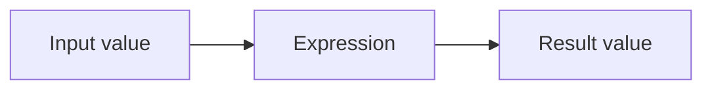
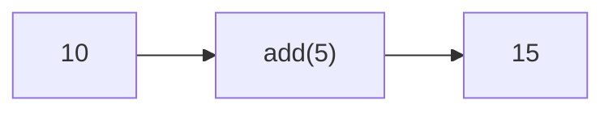
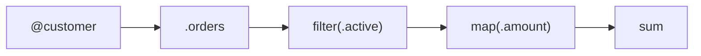

Expressif is a language for describing data transformations, validations, computations, and aggregations as expressions.

If you already have some programming experience, the most useful mental model is simple:



An expression can be as small as a single function:

```expressif
upper
```

or a pipeline of transformations:

```expressif
@customer
| .orders
| filter(.active)
| map(.amount)
| sum
```

The value flows from left to right. Each step receives a value and produces another value.

## A first expression

Consider:

```expressif
10 | add(5)
```

The input value is `10`. The function `add(5)` receives that value and returns `15`.



The same idea scales to structured data:

```expressif
@customer
| .orders
| filter(.active)
| map(.amount)
| sum
```



The important point is not the exact data type at every step. It is that every step has a well-defined input and output.

## What to read next

Start with [Expressions](expressions.md) to understand input values, the current object, pipelines, and nested expressions.

Then continue with:

- [Values and types](values-and-types.md) for literals and the Expressif type system.
- [References](references.md) for variables, constants, fields, tuple items, and the current object.
- [Functions](functions.md) for function calls, parameters, named arguments, and return values.
- [Structured values](structured-values.md) for arrays, tuples, records, mapping, filtering, and aggregation.
- [Predicates](predicates.md) for expressions that answer yes/no questions.
- [Shorthands](shorthands.md) for shorter forms of common expressions.
- [Advanced expressions](advanced.md) for parameterized expressions, array spread, incoming values, intervals, folds, and related constructs.
- [The Expressif philosophy](philosophy.md) for the design principles behind the language.

## Read expressions as transformations

When reading Expressif, avoid thinking in terms of statements such as:

```text
set x
loop
if
assign
return
```

Prefer to read:

```text
input
→ transform
→ select
→ aggregate
→ result
```

That is the core of the language.
