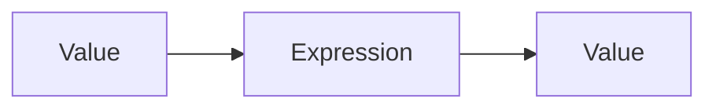
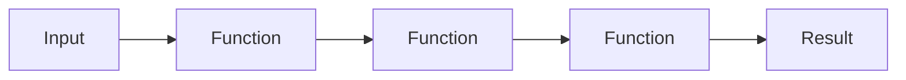
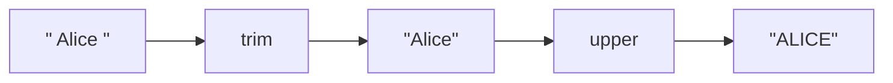
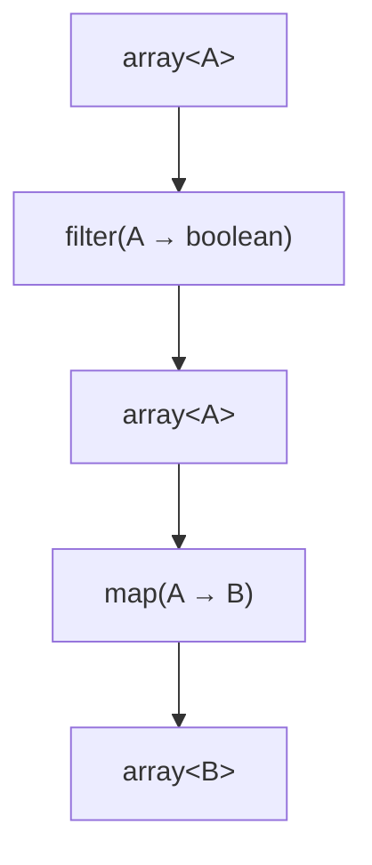
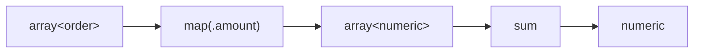
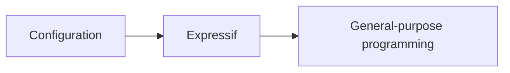

Expressif is designed around one central idea:

> Data logic is easier to read when it is expressed as transformations of values.

It is not intended to replace a general-purpose programming language. It gives you a compact language for the part of an application, pipeline, test, or configuration that says how data should be transformed, selected, validated, compared, or aggregated.

## Values flow through expressions

An Expressif expression starts from a value and produces a value.



A pipeline extends that model:



For example:

```expressif
@customer
| .orders
| filter(.active)
| map(.amount)
| sum
```

You can read this as:

> Start with the customer, take its orders, keep the active ones, project their amounts, and sum them.

The expression describes the result rather than a sequence of mutable instructions.

## Almost everything behaves like a function

A useful user-facing model is to think of most Expressif constructs as functions from one value to another.

<div class="construct-grid">
  <div class="construct-card">
    <span class="construct-card__kind">Transformation</span>
    <code class="construct-card__expression">upper</code>
    <span class="construct-card__arrow" aria-hidden="true">:</span>
    <code class="construct-card__contract">text → text</code>
  </div>
  <div class="construct-card">
    <span class="construct-card__kind">Predicate</span>
    <code class="construct-card__expression">is-positive</code>
    <span class="construct-card__arrow" aria-hidden="true">:</span>
    <code class="construct-card__contract">numeric → boolean</code>
  </div>
  <div class="construct-card">
    <span class="construct-card__kind">Field reference</span>
    <code class="construct-card__expression">.name</code>
    <span class="construct-card__arrow" aria-hidden="true">:</span>
    <code class="construct-card__contract">record → value</code>
  </div>
  <div class="construct-card">
    <span class="construct-card__kind">Accumulator</span>
    <code class="construct-card__expression">sum</code>
    <span class="construct-card__arrow" aria-hidden="true">:</span>
    <code class="construct-card__contract">array&lt;numeric&gt; → numeric</code>
  </div>
</div>

This does not mean every syntax node is implemented as the same runtime object. It means you can understand the language through composition instead of memorizing unrelated constructs.

## Functions compose

Composition is what makes the pipeline useful.

```expressif
"  Alice  "
| trim
| upper
```



The output of one function becomes the input of the next.

Because composition is explicit, longer expressions can remain readable without introducing temporary variables for every intermediate value.

## Expressions can be passed to functions

Some functions do not only receive values. They receive expressions describing what to do with their input.

For example:

```expressif
@orders
| filter(.active)
| map(.amount)
```

`filter(...)` receives a predicate expression. `map(...)` receives a projection expression.

Conceptually:



This makes small expressions reusable building blocks inside larger expressions.

Higher-order functions retain the supplied expression's semantics. For example, `walk(trim)` recursively applies normal coercion to leaves, while `walk(*trim)` trims only leaves that are already text. A complete leaf pipeline can be guarded with grouping: `walk(*(trim | append-space))`.

## Predicates are functions too

A predicate is not a separate mini-language. It is an expression whose result is boolean.

```expressif
.age | greater-than(18)
```

That means predicates can be composed, nested, and passed to functions such as `filter`.

```expressif
@people
| filter(.age | greater-than(18))
```

This consistency is intentional: learning how expressions work should also teach you how predicates work.

## Aggregation follows the same model

Accumulators reduce a collection to a value.

```expressif
@orders
| map(.amount)
| sum
```



The transition from one value to many, or many values to one, remains explicit in the pipeline.

## Prefer data flow over control flow

A general-purpose program might say:

```text
create a total
loop over orders
if the order is active
    add its amount
return the total
```

Expressif says:

```expressif
@orders
| filter(.active)
| map(.amount)
| sum
```

This is not simply shorter syntax for a loop. It reflects a different way of describing the problem: define the transformations that lead from input to output.

## Syntax should make common expressions easier to read

Expressif includes shorthands because frequently used expressions should not become visually noisy.

A shorthand should not introduce a second semantic model. It should provide a shorter way to express something that already has a clear meaning in the language.

That is why the best way to learn Expressif is:

1. understand values, references, functions, and expressions;
2. understand how they compose;
3. then learn the shorthands.

See [Shorthands](shorthands.md) for that compact syntax.

## Expressif sits between configuration and programming

Expressif is intentionally more expressive than configuration and less general than a programming language.



It is meant to express data logic such as:

- selecting values;
- transforming values;
- validating values;
- comparing values;
- constructing records and collections;
- aggregating values;
- composing reusable expressions.

It deliberately avoids requiring users to think first about classes, mutable state, explicit loops, or statement-oriented control flow.

That narrow focus is a feature: it keeps expressions portable, inspectable, and suitable for use outside normal source code.
