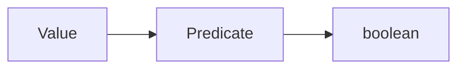
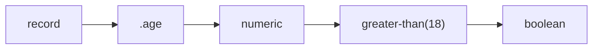
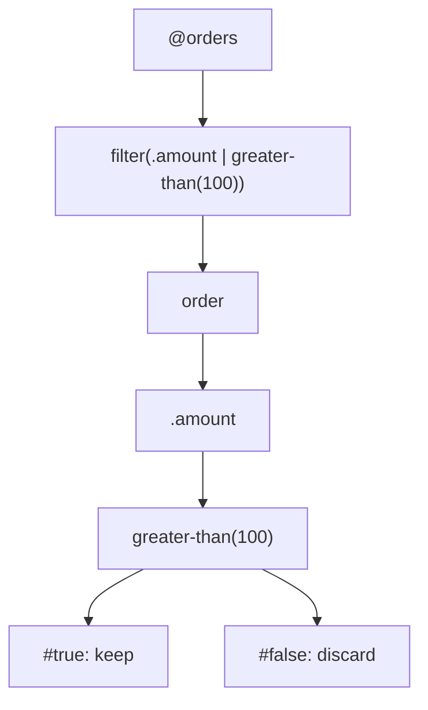
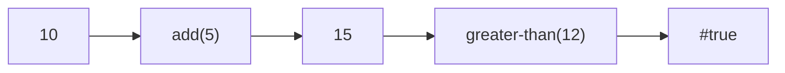
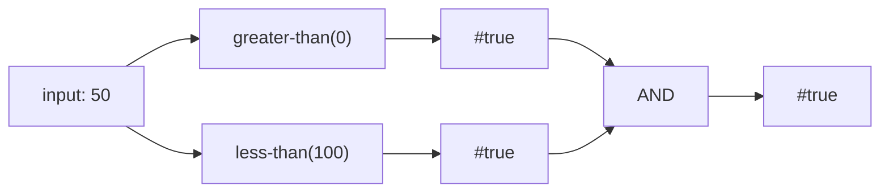

A predicate is an expression that produces a boolean value.



Predicates are used whenever an expression needs to answer a yes/no question.

## A simple predicate

For example:

```expressif
.age | greater-than(18)
```

The field reference produces a numeric value and the predicate produces a boolean.



## Predicates are expressions

A predicate is not a separate language.

It can use:

- references;
- functions;
- pipelines;
- variables;
- constants;
- operators;
- nested expressions.

For example:

```expressif
.amount
| multiply(.quantity)
| greater-than(@threshold)
```

This remains a normal expression whose final value happens to be boolean.

## Predicates in `filter`

One of the most common uses of predicates is filtering.

```expressif
@orders
| filter(.amount | greater-than(100))
```

The predicate `.amount | greater-than(100)` is evaluated for each order. It reads the order amount and explicitly tests whether that amount is greater than `100`.



## Boolean fields can already be predicates

If a field is boolean, the field access itself can serve as the predicate.

```expressif
filter(.active)
```

There is no need to compare it with `#true` unless doing so improves clarity for a specific case.

## Combining predicates

The ordinary pipe `|` and the predicate combinators `|AND`, `|OR`, and `|XOR` do not pass values in the same way.

### The ordinary pipe

The ordinary pipe passes the output of one operation to the next operation:

```expressif
10 | add(5) | greater-than(12)
```

Here, `add(5)` receives `10` and produces `15`. That `15` becomes the input of `greater-than(12)`, which produces `#true`.



### Predicate combinators

The predicate combinators do not send the boolean result of the left predicate into the right predicate. Both predicates apply to the same input, and their boolean results are then combined.

```expressif
greater-than(0) |AND less-than(100)
```

For an input of `50`, both `greater-than(0)` and `less-than(100)` receive `50`. Their results are combined with a logical AND.

It is not equivalent to:

```expressif
greater-than(0) | less-than(100)
```

With the ordinary `|`, `less-than(100)` would receive the `#true` output of `greater-than(0)`, not the original value `50`.



#### Shorthand forms

`|AND` is shorthand for the two-expression form:

```expressif
and(greater-than(0), less-than(100))
```

The other combinators follow the same model:

```expressif
left |OR right
left |XOR right
```

which correspond to:

```expressif
or(left, right)
xor(left, right)
```

The shorthand changes only how the composition is written. It retains the behavior of the corresponding `and`, `or`, or `xor` function.

#### Short-circuit evaluation

`|AND` and `|OR` use short-circuit evaluation:

- `|AND` stops as soon as the left predicate returns `#false`, because the complete expression cannot become true;
- `|OR` stops as soon as the left predicate returns `#true`, because the complete expression cannot become false;
- `|XOR` always evaluates both predicates because its result depends on both values.

This distinction also explains expressions that contain both forms of pipe:

```expressif
(@amount | greater-than(0))
|AND
(@currency | equal-to("EUR"))
```

Inside each group, `|` passes the referenced value to its predicate. Between the groups, `|AND` combines their boolean results; it does not pass the result of `greater-than(0)` to `@currency`.

See [Shorthands](shorthands.md#combining-predicates) for the long and shorthand forms.

## Negation

Negation reverses a boolean result.

The long form is:

```expressif
predicate | not
```

The shorthand places `!` before the predicate.

For example:

```expressif
!greater-than(100)
```

should be read as:

> the current value is not greater than 100

rather than as a separate special evaluation mechanism.

## Predicates for validation

Predicates can also be used outside collection filtering.

An application can evaluate a predicate to validate an input:

```expressif
@amount | greater-than(0)
```

Several validation conditions can be composed with the predicate combinators described above.

The expression still produces a normal boolean value. What the calling application does with that result is outside the predicate itself.

## Prefer expressive predicates

A good predicate should communicate the business rule being tested.

Prefer:

```expressif
.amount | greater-than(@minimum)
```

over constructing a more indirect transformation whose boolean meaning is difficult to recognize.

Predicates are most effective when the reader can quickly answer:

> What condition must be true?
