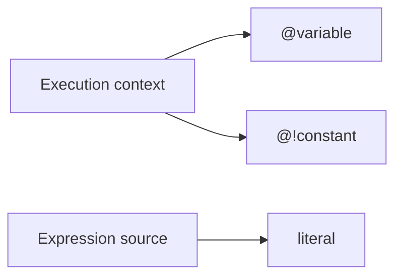
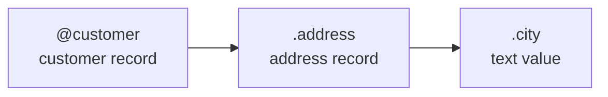
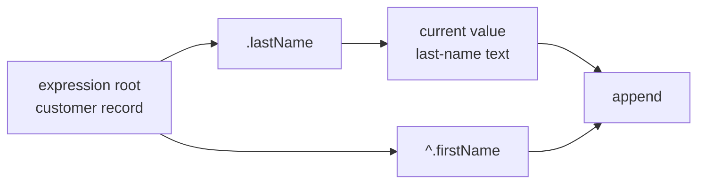
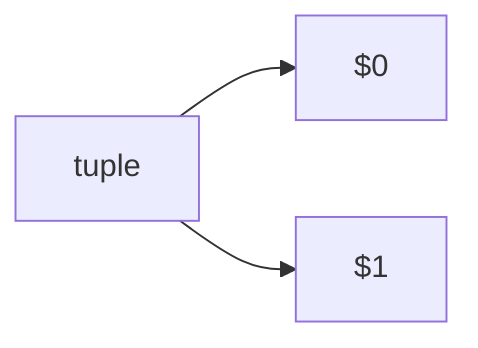
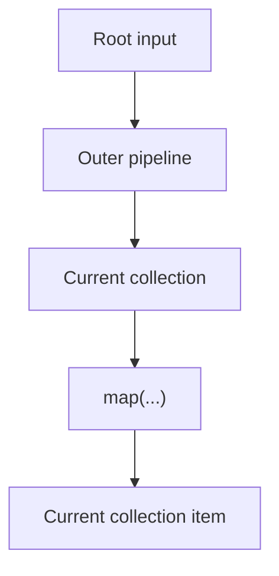
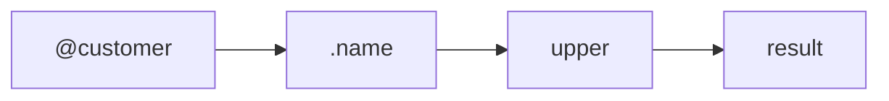

References let an expression reach values that are already available in its evaluation context.

The most important question when reading a reference is:

> Which value does this reference start from?

## Variables

Variables are values supplied by the execution context.

A variable is referenced with `@`.

```expressif
@customer
@threshold
@country
```

Variables are useful when an expression needs information that is not part of its current pipeline value.

For example:

```expressif
@amount | greater-than(@threshold)
```

Both values come from the execution context.

## Constants

Constants are named values supplied to the expression context. A constant is referenced with `@!`.

Examples include:

```expressif
@!pi
@!e
@!taxRate
```

Constants must be added to the context before the expression is evaluated. They are intended for values that remain stable during evaluation, while variables can change between evaluations.

Literals are different: they are written directly in the expression and do not need to be provided by the context. For example, `10`, `"hello"`, `#true`, and `#null` are literals, not constants.

Conceptually, variables, constants, and literals obtain their values from different places:



A constant is therefore named like a reference but behaves as a stable, context-provided value.

## Field references

Fields of records can be addressed by name.

```expressif
.name
.address
.amount
@customer.address.city
```

A reference beginning with `.` starts from the current object. A reference beginning with `@name` starts again from the corresponding context variable.

A reference beginning with `^.` starts from the input of the current expression. This is useful when the current value has already changed later in the pipeline.

Field references are especially common inside `map`, `filter`, record construction, and predicates.

For example:

```expressif
@orders
| map(.amount)
```

Inside the projection, `.amount` refers to the amount field of the current order.

## The current object

The current object is the value currently being evaluated. It evolves as an expression moves through references and functions.

Consider a `customer` variable containing an address. A nested field can be referenced directly:

```expressif
@customer.address.city
```

The reference is evaluated from left to right. `@customer` makes the customer record current, `.address` makes its address record current, and `.city` makes the city value current.



This changing context matters when a later reference starts with `.`. For example, the following expression is wrong:

```expressif
@customer
| .lastName
| append(", ")
| append(.firstName)
```

After `.lastName`, the current object is the last-name text, not the customer record. The `.firstName` reference therefore tries to find `firstName` on that text value.

Refer to the context variable again when the value must be read from the original customer:

```expressif
@customer
| .lastName
| append(", ")
| append(@customer.firstName)
```

If `lastName` is `"Doe"` and `firstName` is `"Jane"`, the result is:

```expressif
"Doe, Jane"
```

## Expression-root field references

The `^.` prefix reads a field from the input, or root, of the current expression rather than from the value currently flowing through its pipeline. Pipeline stages preserve that root; invoking a nested expression establishes a new root from the value passed to that expression.

For example, when the customer record is the input of the expression:

```expressif
.lastName
| append(", ")
| append(^.firstName)
```

After `.lastName`, the current value is the last-name text. The expression root is still the customer record, so `^.firstName` can read its `firstName` field and the expression produces `"Doe, Jane"`.



An expression-root field reference can also be a pipeline stage. For example, `.lastName | upper | ^.firstName` returns `firstName` from the record supplied to `.lastName`, regardless of the intermediate uppercase text.

## Tuple positions

Tuple values are addressed by position.

Expressif uses positional references such as:

```expressif
$0
$1
```

Positions are zero-based: `$0` refers to the first tuple item, `$1` to the second, and so on. This is distinct from `#n`, which reads an item by index from the persistent current object.

These are useful with functions that supply tuples or multiple related values to a nested expression.

For example, an operation over adjacent values can expose the previous and current values as tuple positions.



The exact positions available depend on the function that creates the nested context.

## Root input and nested input

Nested expressions can change what is considered current.

Conceptually:



Inside `map(...)`, the current object and expression root are the individual collection item. A `^.field` inside that nested expression therefore reads the mapped item, not the root of the outer expression.

When you need data from outside that nested scope, use the appropriate reference syntax rather than assuming the outer current object is still available implicitly.

## References should make scope visible

A useful rule when reading or writing Expressif is:

- `@name` points to a variable supplied by the environment;
- `@!name` points to a constant supplied to the expression context;
- `.field` starts from the current record;
- `^.field` starts from the input/root of the current expression;
- `$n` addresses a zero-based position in the current tuple-like context;
- `#n` reads a zero-based item from the persistent current object.

This makes scope visible directly in the expression.

## References are expressions

A reference produces a value, so it can participate in a pipeline like any other expression.

```expressif
@customer
| .name
| upper
```



That consistency is what makes references easy to compose with functions.
