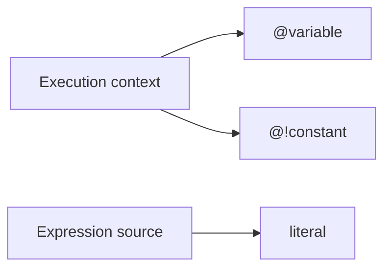
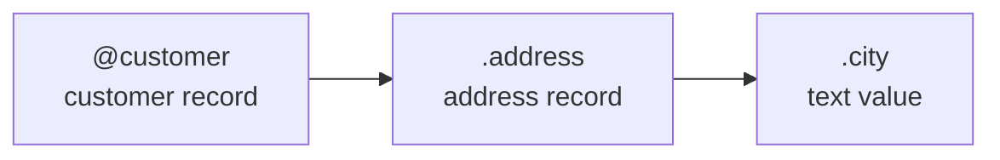
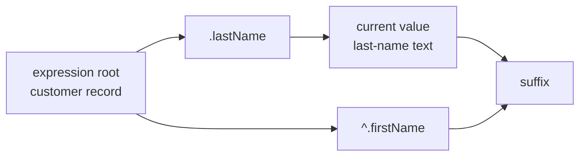
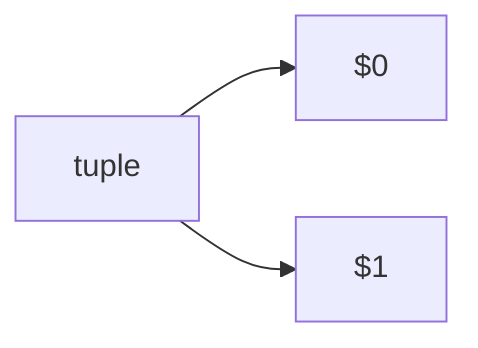
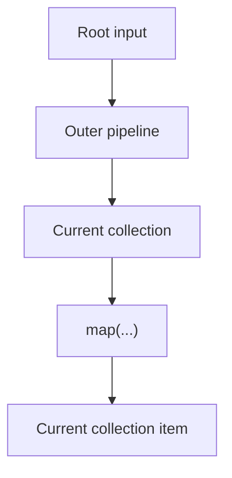
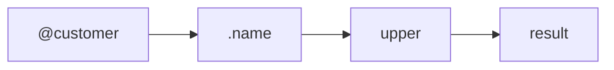

References let an expression reach values that are already available in its evaluation context.

The most important question when reading a reference is:

> Which value does this reference start from?

## Variables

Variables are values supplied by the execution context.

A variable is referenced with `@`.

```expressif
@customer
@threshold
@country
```

Variables are useful when an expression needs information that is not part of its current pipeline value.

For example:

```expressif
@amount | greater-than(@threshold)
```

Both values come from the execution context.

## Constants

Constants are named values supplied to the expression context. A constant is referenced with `@!`.

Examples include:

```expressif
@!pi
@!e
@!taxRate
```

Constants must be added to the context before the expression is evaluated. They are intended for values that remain stable during evaluation, while variables can change between evaluations.

Literals are different: they are written directly in the expression and do not need to be provided by the context. For example, `10`, `"hello"`, `#true`, and `#null` are literals, not constants.

Conceptually, variables, constants, and literals obtain their values from different places:



A constant is therefore named like a reference but behaves as a stable, context-provided value.

## Field references

Fields of records can be addressed by name.

```expressif
.name
.address
.amount
@customer | .address.city
```

A reference beginning with `.` starts from the current object. A reference beginning with `@name` starts again from the corresponding context variable.

A reference beginning with `^.` starts from the input of the current expression. This is useful when the current value has already changed later in the pipeline.

Chained field access is shorthand for successive field lookups:

```expressif
.field1.field2.field3
```

This is equivalent to `.field1 | .field2 | .field3`, or `field("field1") | field("field2") | field("field3")`. Each lookup uses the value returned by the previous one. A missing field, null intermediate value, or intermediate value without named fields produces `#null`.

The `field` function still reads one literal field name: `field("field1.field2.field3")` accesses a single field containing dots in its name.

Root prefixes apply only to the first lookup: `^.address.city` means `^.address | .city`, and `^^.address.city` means `^^.address | .city`. To start from a variable, use `@customer | .address.city`.

Field references are especially common inside `map`, `filter`, record construction, and predicates.

For example:

```expressif
@orders
| map(.amount)
```

Inside the projection, `.amount` refers to the amount field of the current order.

## The current object

In a pipeline, each field-access step reads the value arriving at that step. An argument expression has a separate context determined by its parameter.

Consider a `customer` variable containing an address. A nested field can be referenced directly:

```expressif
@customer | .address.city
```

The reference is evaluated from left to right. `@customer` makes the customer record current, `.address` makes its address record current, and `.city` makes the city value current.



Inside a function argument, check the parameter's context. For example:

```expressif
{firstName := "Jane", lastName := "Doe"}
| .lastName
| suffix(", ")
| suffix(.firstName)
```

The incoming value for the final `suffix` call is `"Doe, "`. Its argument uses the enclosing record, so `.firstName` reads `"Jane"`. The result is:

```expressif
"Doe, Jane"
```

See [Incoming and enclosing contexts](argument-contexts.md) for diagrams explaining how argument contexts differ from the values flowing through a pipeline.

## Expression-root field references

The `^.` prefix reads a field from the input, or root, of the current expression rather than from the value currently flowing through its pipeline. Pipeline stages preserve that root; invoking a nested expression establishes a new root from the value passed to that expression.

For example, when the customer record is the input of the expression:

```expressif
.lastName
| suffix(", ")
| suffix(^.firstName)
```

After `.lastName`, the current value is the last-name text. The expression root is still the customer record, so `^.firstName` can read its `firstName` field and the expression produces `"Doe, Jane"`.



An expression-root field reference can also be a pipeline stage. For example, `.lastName | upper | ^.firstName` returns `firstName` from the record supplied to `.lastName`, regardless of the intermediate uppercase text.

## Tuple positions

Tuple values are addressed by position.

Expressif uses positional references such as:

```expressif
$0
$1
```

Positions are zero-based: `$0` refers to the first tuple item, `$1` to the second, and so on. This is distinct from `#n`, which reads an item by index from the persistent current object.

These are useful with functions that supply tuples or multiple related values to a nested expression.

For example, an operation over adjacent values can expose the previous and current values as tuple positions.



The exact positions available depend on the function that creates the nested context.

### Explicit expression scopes

Prefix a zero-based tuple position with carets to select an expression input:

| Reference | Input selected |
| --- | --- |
| `^$1` | Current expression input, second element |
| `^^$1` | Immediately enclosing expression input, second element |
| `^^^$1` | Two enclosing expression scopes out, second element |

Each additional caret moves out exactly one expression scope. Pipeline stages and
grouping parentheses preserve the scope. Invoking a nested expression, such as
the transformation in `map` or the expression in `apply`, establishes a scope.
A nested expression with an explicit source uses that source as its input.

For example, given input `T(10, 20)`:

| Expression | Result |
| --- | --- |
| `apply(T(1, 2) \| ^$1)` | `2` |
| `apply(T(1, 2) \| ^^$1)` | `20` |
| `apply(T(1, 2) \| $0 \| add(^^$1))` | `21` |
| `apply(T(1, 2) \| apply(T(3, 4) \| ^^^$1))` | `20` |

The selected input stays available after pipeline transformations and is restored
when a nested invocation returns or fails. Sibling invocations have independent
inputs. These references work as pipeline stages and as function arguments;
parentheses around a reference do not add a scope.

A missing scope, a null or non-tuple input, or a position outside the selected
tuple returns `null`. A null tuple element also returns `null`. Resolution never
searches another scope for a tuple or a non-null value. The receiving function
applies its usual null handling and parameter coercion. Positions must be
non-negative integers no greater than `2147483647`; larger positions produce a
syntax diagnostic. Negative positions and `$^n` positions are not supported in
caret-qualified references.

`^$n` is the positional counterpart of `^.field`: both read the current
expression's input. `^^$n` and `^^.field` read the immediately enclosing input.
Existing unqualified `$n` and `$^n` behavior is unchanged.

## Root input and nested input

Nested expressions can change what is considered current.

Conceptually:



Inside `map(...)`, the current object and expression root are the individual collection item. A `^.field` inside that nested expression therefore reads the mapped item, not the root of the outer expression.

When you need data from outside that nested scope, use the appropriate reference syntax rather than assuming the outer current object is still available implicitly.

## References should make scope visible

A useful rule when reading or writing Expressif is:

- `@name` points to a variable supplied by the environment;
- `@!name` points to a constant supplied to the expression context;
- `.field` starts from the current record;
- `^.field` starts from the input/root of the current expression;
- `^^.field` starts from the input/root of the enclosing expression;
- `$n` addresses a zero-based position in the current tuple-like context;
- `#n` reads a zero-based item from the persistent current object.

This makes scope visible directly in the expression.

## Enclosing expression roots

A nested expression can read a field from the expression that contains it by using `^^.`. This is useful when an outer expression prepares a value that every nested collection item needs:

```expressif
with(
    amounts := map(.amount),
    threshold := map(.amount) | max | divide(2),
    .amounts | filter(greater-than(^^.threshold)) | sum
)
```

The body of `with(...)` receives the temporary record containing `amounts` and `threshold`. Inside `filter(...)`, `^.threshold` would look for `threshold` on the current amount because that amount is the filter expression's root. `^^.threshold` instead reads it from the enclosing `with(...)` body root.

An enclosing-root reference uses a bare field name after `^^.`. When no enclosing expression exists, or its root does not contain the requested field, the reference evaluates to `null`.

## References are expressions

A reference produces a value, so it can participate in a pipeline like any other expression.

```expressif
@customer
| .name
| upper
```



That consistency is what makes references easy to compose with functions.
