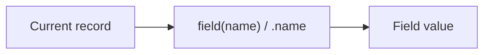
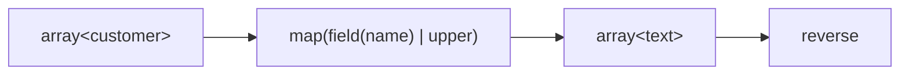

Expressif provides shorthands to keep common expressions concise.

The important rule is:

> A shorthand should make an existing concept shorter to write, not introduce a different semantic model.

Learn the explicit concepts first, then use the shorthand when it improves readability.

## Reading a field

The canonical form uses the `field` function:

```expressif
field(name)
```

The shorthand form is:

```expressif
.name
```

Both forms read the `name` field from the current input.



Use the long form when the field name is dynamic or must be quoted. In the first example, `@requestedField` is a context variable whose value is the field name as text:

```expressif
field(@requestedField)
field("customer name")
```

## Mapping an array

The canonical form uses `map`:

```expressif
@customers
| map(field(name) | upper)
| reverse
```

The `|> (...)` shorthand replaces `| map(...)`:

```expressif
@customers
|> (.name | upper)
| reverse
```

The parentheses around the mapped expression are mandatory. After the closing parenthesis, the ordinary `|` resumes the pipeline with the complete mapped array.



## Reading a tuple position

The canonical form uses `tuple-at` with a zero-based position:

```expressif
tuple-at(0)
tuple-at(1)
```

The shorthand forms are `$0` and `$1`:

```expressif
$0
$1
```

Both `tuple-at(0)` and `$0` read the first tuple item. Both `tuple-at(1)` and `$1` read the second.

## Combining predicates

The canonical forms use the `and`, `or`, and `xor` functions:

```expressif
and(greater-than(0), less-than(100))
or(left, right)
xor(left, right)
```

Their shorthand forms are:

```expressif
greater-than(0) |AND less-than(100)
left |OR right
left |XOR right
```

The ordinary `|` passes an output to the next operation. The predicate shorthands apply both predicates to the same input and combine their boolean results.

## Negating a predicate

The canonical form pipes the predicate result to `not`:

```expressif
greater-than(100) | not
```

The shorthand form is:

```expressif
!greater-than(100)
```

## Unsupported operator syntax

Expressif does not support infix arithmetic or comparison operators such as `+`, `*`, `>`, or `==`. Use named functions and predicates instead:

```expressif
a | add(b)
a | multiply(b)
a | greater-than(b)
a | equal-to(b)
```

Use `oppose` for numeric negation. A leading sign remains valid as part of a numeric literal, such as `-10`.

## Shorthands should compose

Long forms and shorthands can be combined in the same expression. For example, the canonical form:

```expressif
@orders
| filter(
    or(
        field(amount) | greater-than(100),
        field(priority) | equal-to("high")
    )
)
| map(field(amount))
```

can be shortened to:

```expressif
@orders
| filter(
    .amount | greater-than(100)
    |OR
    .priority | equal-to("high")
)
|> (.amount)
```

The shorter expression keeps the same value-flow model: `.field` replaces `field(...)`, `|OR` replaces `or(..., ...)`, `|> (...)` replaces `| map(...)`, and `*expression` replaces `guard(expression)`.

The guarded shorthand preserves expression boundaries. `*trim` guards one function, while `*(trim | append-space)` guards the whole grouped pipeline. There is no separate `|*` operator.

## Prefer readability over density

Shorter is not automatically better.

This:

```expressif
@orders
| filter(.amount | greater-than(100))
| map(.amount)
| sum
```

is already concise and communicates the stages clearly.

Avoid stacking several shorthands when doing so makes scope or precedence harder to see.

The purpose of shorthand is to remove noise, not to turn Expressif into code golf.
