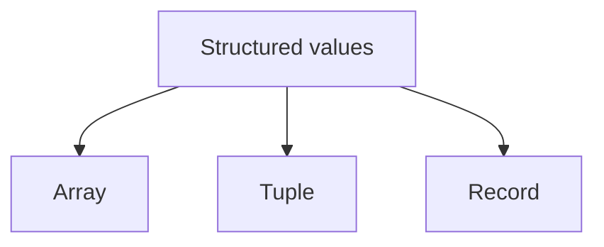
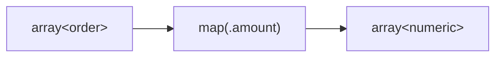
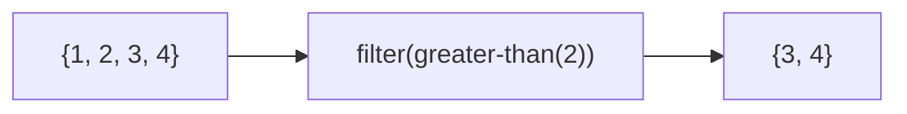
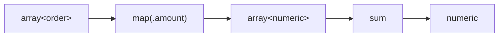
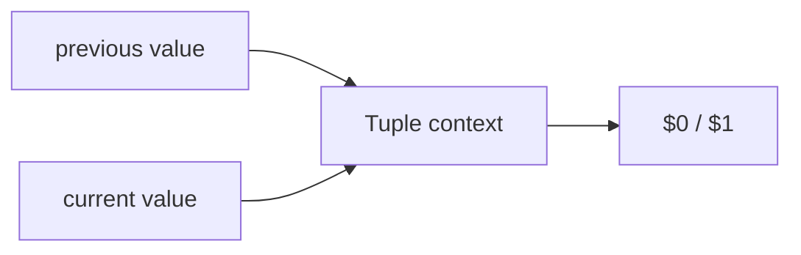
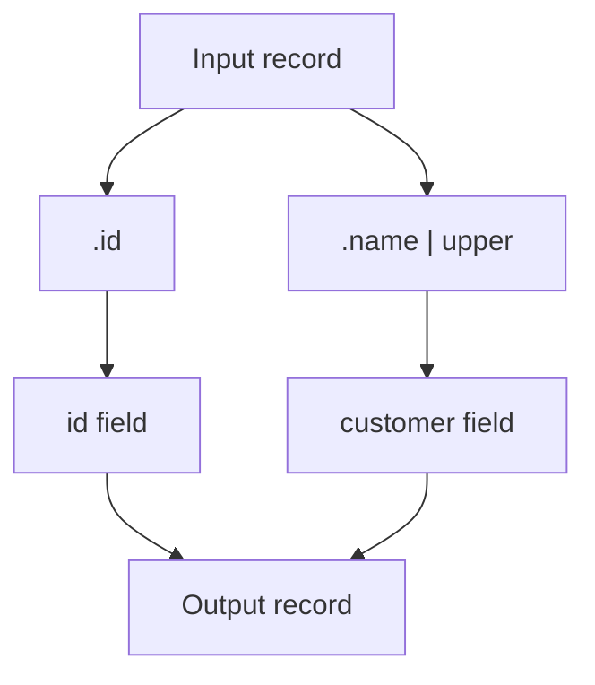
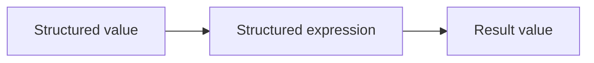

Expressif works with structured values as naturally as it works with scalar values.

The three main structured forms are:



They solve different problems.

## Arrays

An array represents a sequence of values.

Example:

```expressif
{1, 2, 3}
```

Arrays are appropriate when the number of values can vary and the values represent the same kind of thing.

Typical operations include:

```expressif
map(...)
filter(...)
adjacent(...)
sum
count
```

depending on the available function catalog.

## Mapping arrays

`map` transforms every element.

```expressif
@orders
| map(.amount)
```



The expression passed to `map` is evaluated against each element.

## Filtering arrays

`filter` keeps elements for which a predicate evaluates to true.

```expressif
{1, 2, 3, 4}
| filter(greater-than(2))
```



The `greater-than(2)` predicate is evaluated for each element. Only values for which it returns `#true` are kept, producing `{3, 4}`.

## Aggregating arrays

Accumulators reduce an array to a result.

```expressif
@orders
| map(.amount)
| sum
```



Other accumulators can produce text, counts, booleans, or structured results depending on their contract.

## Tuples

A tuple represents a fixed set of positional values.

Conceptually:

```expressif
T("Alice", 42)
```

Tuple positions are accessed with positional references such as:

```expressif
$0
$1
```

Positions are zero-based, so `$0` refers to the first value and `$1` to the second.

Tuples are useful when a function needs to expose several related values without assigning field names.

For example, an adjacent-window operation can provide two neighboring values as a tuple-like context.



## Records

A record contains named fields.

Conceptually:

```expressif
{name:="Alice", age:=42}
```

Fields can contain scalar or structured values.

```expressif
{
    name:="Alice",
    totals:={10, 20, 30}
}
```

Fields are accessed by name:

```expressif
.name
.totals
```

## Constructing records

Record construction is useful when you want to project one structure into another.

For example:

```expressif
record(
    id:=.id,
    customer:=.name | upper
)
```

Each field value is itself an expression.

Conceptually:



This makes records an important tool for shaping data, not only storing it.

## Arrays, tuples, and records are different

Use an array when:

- there can be zero, one, or many elements;
- elements are conceptually peers;
- collection functions should operate over them.

Use a tuple when:

- the number of positions is fixed;
- position has meaning;
- names are unnecessary or would add noise.

Use a record when:

- fields have distinct meanings;
- field names are part of the structure;
- data should be self-describing.

## Nested structured values

Structured values can be nested.

An array of records:

```expressif
{
    {name:="Alice", age:=42},
    {name:="Bob", age:=37}
}
```

A record containing arrays:

```expressif
{
    customer:="Alice",
    orders:={10, 20, 30}
}
```

A tuple can also contain arrays, records, or other tuples where the function contract allows it.

## Structured transformations stay value-oriented

Even when an expression processes many elements, the same mental model applies:



You do not need to think first in terms of loops. Think in terms of transformations over structured values.
