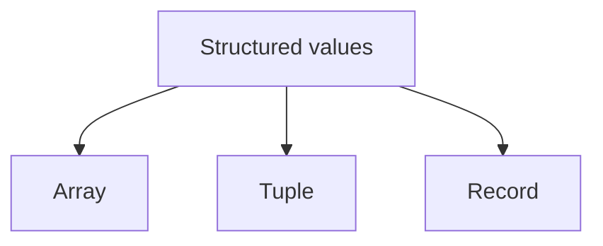
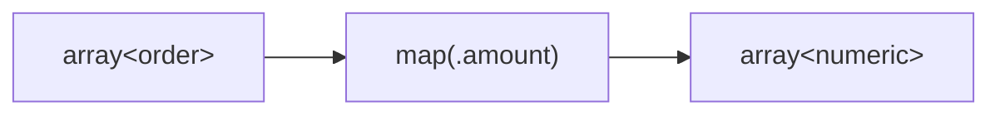
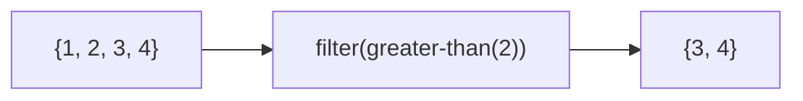
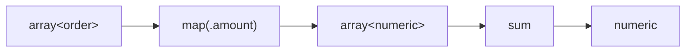
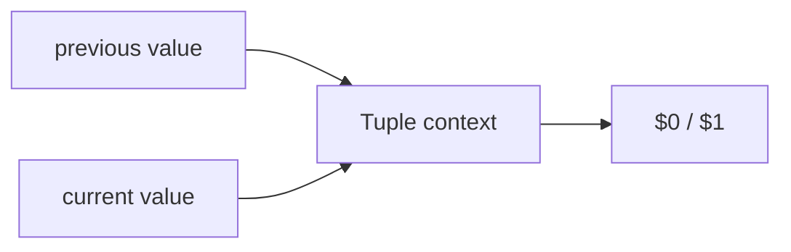
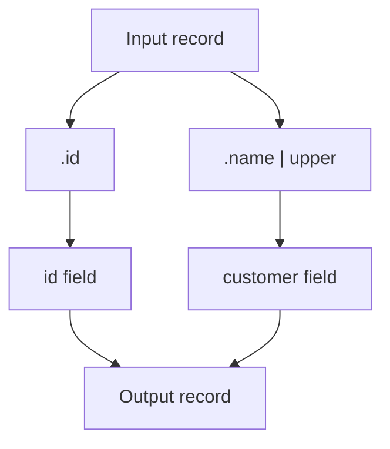
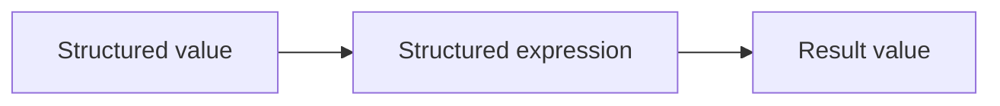

Expressif works with structured values as naturally as it works with scalar values.

The three main structured forms are:



They solve different problems.

## Arrays

An array represents an ordered sequence of peer values. Its elements may all be available already or may become available progressively as the sequence is consumed.

Example:

```expressif
{1, 2, 3}
```

Arrays are appropriate when the number of values can vary and the values represent the same kind of thing. Collection operations can process the sequence element by element; operations that need to compare, reorder, or inspect the complete sequence may collect its elements before returning a result.

Typical operations include:

```expressif
map(...)
filter(...)
adjacent(...)
sum
count
```

depending on the available function catalog.

## Mapping arrays

`map` transforms every element.

```expressif
@orders
| map(.amount)
```



The expression passed to `map` is evaluated against each element.

## Filtering arrays

`filter` keeps elements for which a predicate evaluates to true.

```expressif
{1, 2, 3, 4}
| filter(greater-than(2))
```



The `greater-than(2)` predicate is evaluated for each element. Only values for which it returns `#true` are kept, producing `{3, 4}`.

## Aggregating arrays

Accumulators reduce an array to a result.

```expressif
@orders
| map(.amount)
| sum
```



Other accumulators can produce text, counts, booleans, or structured results depending on their contract.

## Tuples

A tuple represents a fixed, positional value. Its number of elements is known, every element can be accessed by position, and different positions may have different meanings.

Conceptually:

```expressif
T("Alice", 42)
```

Tuple positions are accessed with positional references such as:

```expressif
$0
$1
```

Positions are zero-based, so `$0` refers to the first value and `$1` to the second.

Tuples are useful when a function needs to expose several related values without assigning field names.

For example, an adjacent-window operation can provide two neighboring values as a tuple-like context.



### Pairs and groups are specialized tuples

A pair participates in tuple semantics as a fixed positional value of arity two. Its key is position `$0` and its value is position `$1`; from-end references address the same positions as `$^2` and `$^1`, respectively.

```expressif
("BE" => 42) | arity
```

returns `2`, and `("BE" => 42) | $1` returns `42`. The `is-tuple` predicate and `is-type(:tuple)` likewise return `#true` for pairs.

A group is a specialized pair. In tuple context, `$0` is its key and `$1` is the complete grouped-values collection. This positional view does not alter collection behavior: mapping or enumerating a group still operates on its grouped values. A grouping is not itself a tuple; only each group inside it is.

Tuple-producing operations normalize specialized inputs. Applying `swap`, `pick`, or `extend` to a pair or group always returns an ordinary tuple:

```expressif
("BE" => 42) | swap → T(42, "BE")
("BE" => 42) | pick(1, 0) → T(42, "BE")
("BE" => 42) | extend(7) → T("BE", 42, 7)
```

Pairs, groups, and two-position tuples compare by their positional values. Consequently, the pair `("BE" => {code := "BE", name := "Bob"})` and the tuple `T("BE", {code := "BE", name := "Bob"})` are equal when compared. This includes positions containing structurally equal arrays or records. Equal positional values also have equal hash codes.

## Records

A record contains named fields.

Conceptually:

```expressif
{name:="Alice", age:=42}
```

Fields can contain scalar or structured values.

```expressif
{
    name:="Alice",
    totals:={10, 20, 30}
}
```

Fields are accessed by name:

```expressif
.name
.totals
```

## Constructing records

Record construction is useful when you want to project one structure into another.

For example:

```expressif
record(
    id:=.id,
    customer:=.name | upper
)
```

Each field value is itself an expression.

Conceptually:



This makes records an important tool for shaping data, not only storing it.

## Arrays, tuples, and records are different

Use an array when:

- there can be zero, one, or many elements;
- elements are conceptually peers;
- collection functions should operate over them.

Use a tuple when:

- the number of positions is fixed;
- position has meaning;
- names are unnecessary or would add noise.

Use a record when:

- fields have distinct meanings;
- field names are part of the structure;
- data should be self-describing.

The distinction is based on structure, not size. A two-element array is still an array, while a tuple can contain more than two elements.

## Reasoning about shape

The shape of a value is more than its type. When reading a transformation, ask three separate questions:

1. What is the outer value: a scalar, array, tuple, or record?
2. How many elements or fields can the result contain?
3. What shape can each contained value have?

An operation can preserve one of these properties while changing another. For example, mapping an array preserves the outer array and produces one result for every input element, but the mapped expression can turn each scalar into a tuple, record, or nested array:

```expressif
{10, 20} |> record(score:=@_, name:=multiply(10))
```

Conceptually, this changes `array<numeric>` into `array<record>` without changing the outer container or its cardinality.

Use these broad categories to reason about a pipeline:

| Category | Outer result | Cardinality | Element shape |
|---|---|---|---|
| Mapping | Array remains an array | One result per input element | May change |
| Filtering | Array remains an array | From zero to the input count | Selected values are unchanged |
| Ordering | Array remains an array | Same as the input | Preserved |
| Grouping, pairing, or windowing | Array remains an array | Defined by the operation | Explicitly grouped or projected |
| Reduction | Container is consumed | One result | Defined by the accumulator |
| Construction or conversion | Explicitly chosen container | Defined by the construct | Preserved or projected as documented |

These are reasoning categories, not an exhaustive function list. Consult the [function reference]({{ '/functions/' | relative_url }}) for the exact input, output, cardinality, and edge cases of an individual operation.

## Element-wise and whole-collection evaluation

Expressif does not automatically apply a scalar function to every item in a structured value. Mapping is explicit: `map(expression)` and its `|> (expression)` shorthand evaluate the expression once for every array item.

Other functions receive the complete structured value. An accumulator such as `sum` consumes the whole array and returns one result. `scan` also consumes the array as an accumulation but returns each intermediate result, while `broadcast` repeats the final accumulated result once per input element. That behavior belongs specifically to the `broadcast` function; it is not a general rule that scalar arguments are broadcast across collections.

A tuple passed to a function is likewise one input value. If the function expects an array, the tuple may first be coerced to an array as described below. That does not mean the function is independently applied to each tuple position.

## Spread expands; it does not map or flatten

Spread is explicit expansion during construction. In an array construction, a spread array contributes its elements at that position:

```expressif
{1, ...{2, 3}, 4}
```

produces `{1, 2, 3, 4}`. In `record(...)`, a standalone `...` contributes the incoming record's fields to the new record.

Spread does not evaluate a transformation for each element, and it does not recursively flatten nested collections. `{1, ...{{2, 3}}, 4}` still contains the nested array `{2, 3}` as one element. See [Advanced expressions](advanced.md#array-spread-arguments) for the supported spread contexts.

## Tuple positions and record fields

Tuple positions and record field names are parts of their respective shapes. Tuple operations can explicitly select, extend, or reconstruct positions. Converting a tuple to an array discards the tuple container kind, but preserves its element order and values.

Reading a record field projects that field's value and therefore removes the outer record from the result. Constructing a record explicitly creates a new set of named fields. When an operation transforms record field values while preserving the record container, the field names remain unchanged unless that operation's contract says otherwise.

## Tuples as arrays

When a function expects an array, Expressif can coerce a tuple to an array. The tuple positions are presented as array elements in the same order. Array operations then produce arrays rather than preserving tuple structure:

```expressif
T(10, 20, 30) | filter(greater-than(10))
```

returns:

```expressif
{20, 30}
```

This direction is implicit because every tuple has a finite, ordered sequence of elements.

The reverse direction is explicit. An array does not state what each position means, and its number of elements may only become known after consuming it. Use `to-tuple` to collect those elements and create a positional value:

```expressif
{10, 20, 30} | to-tuple
```

returns:

```expressif
T(10, 20, 30)
```

The conversion preserves element order and values. It does not recursively convert arrays nested inside the source array.

## Nested structured values

Structured values can be nested.

An array of records:

```expressif
{
    {name:="Alice", age:=42},
    {name:="Bob", age:=37}
}
```

A record containing arrays:

```expressif
{
    customer:="Alice",
    orders:={10, 20, 30}
}
```

A tuple can also contain arrays, records, or other tuples where the function contract allows it.

Nesting is preserved by default. Collections are not implicitly flattened, and conversions apply to the outer value only unless an operation explicitly documents recursive traversal or reconstruction. For example, converting an array to a tuple does not convert arrays nested inside it.

## Structured transformations stay value-oriented

Even when an expression processes many elements, the same mental model applies:



You do not need to think first in terms of loops. Think in terms of transformations over structured values.
