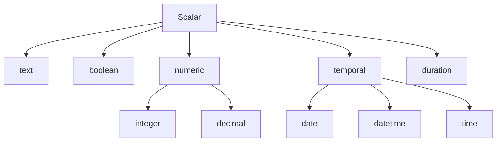
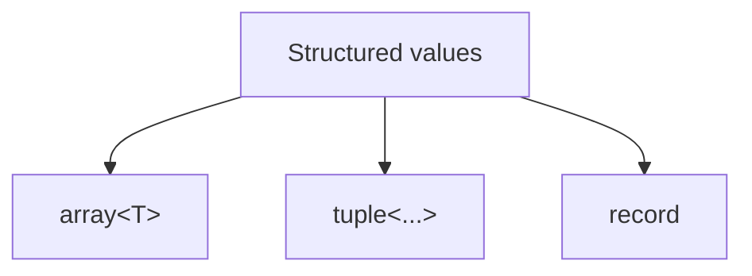

Every Expressif expression operates on values, and every value has a type.

You usually do not need to declare those types explicitly. You do need to understand them because functions specify which input and parameter types they accept.

## Literal values

Common values can be written directly in an expression.

| Type | Literal syntax | Example |
|---|---|---|
| text | A value enclosed in double quotes | `"hello"` |
| empty text | `#empty` | `#empty` |
| blank text | `#blank` | `#blank` |
| integer | Digits, optionally preceded by a sign | `10` or `-10` |
| decimal | Digits with a `.` decimal separator, optionally preceded by a sign | `10.1` or `-10.1` |
| boolean | `#true` or `#false` | `#true` |
| null | `#null` | `#null` |
| date | `#"yyyy-MM-dd"` | `#"2025-12-16"` |
| datetime | `#"yyyy-MM-ddTHH:mm:ss"` | `#"2025-12-16T14:30:00"` |
| time | `#"HH:mm:ss"` | `#"14:30:00"` |
| duration | `#"P[nD][T[nH][nM][nS]]"` | `#"P2DT3H30M"` |

Numeric and temporal literals use invariant notation: the decimal separator is always `.`, and temporal components use the formats shown above. Quotation marks are part of the syntax for text and temporal literals.

## Scalar types

The main scalar type families can be viewed as:



### Text

Text values represent strings.

```expressif
"Alice"
"BE"
"2026-Q3"
```

Expressif also provides two named text literals:

```expressif
#empty
#blank
```

`#empty` represents text containing no characters. `#blank` represents text that is empty or contains only whitespace characters.

Functions such as trimming, padding, casing, matching, or splitting operate on text.

### Boolean

Boolean values are:

```expressif
#true
#false
```

Predicates produce booleans, and logical operators combine them.

### Numeric

`numeric` is the common numeric family.

Write an integer without a decimal separator and a decimal with a `.` decimal separator:

```expressif
10
-10
10.1
-10.1
```

The literals `10` and `-10` have type `integer`; `10.1` and `-10.1` have type `decimal`. A function may accept any numeric value or require one of these more specific numeric types.

### Temporal

Temporal values represent dates and times.

The temporal family includes:

```expressif
date
datetime
time
```

Prefix temporal literals with `#` and enclose their value in double quotes:

```expressif
#"2025-12-16"
#"2025-12-16T14:30:00"
#"14:30:00"
#"P2DT3H30M"
```

These values represent a date, datetime, time, and duration respectively. Dates use `yyyy-MM-dd`; datetimes separate the date and time with `T`; times use a 24-hour clock; and durations use ISO 8601 duration notation. Duration is a distinct scalar type rather than part of the temporal family. Temporal functions can extract components, shift values, compare them, or calculate durations depending on the function.

### Null

`#null` represents the absence of a value.

Null is important because not every transformation can always produce a meaningful non-null value. Conversion functions, missing fields, or optional data can result in null depending on the function and input.

## Structured types

Expressif also works with values containing other values.



### Array

An array contains a sequence of values.

```expressif
{1, 2, 3}
```

Arrays are commonly used with functions such as `map`, `filter`, `adjacent`, accumulators, and other collection transformations.

### Tuple

A tuple contains a fixed sequence of positions.

Conceptually:

```expressif
T("Alice", 42)
```

Tuple items are addressed by position rather than by field name.

### Record

A record contains named fields.

Conceptually:

```expressif
{name:="Alice", age:=42}
```

Fields can be accessed by name:

```expressif
.name
.age
```

See [Structured values](structured-values.md) for construction and transformation of arrays, tuples, and records.

## Type families and specific types

Some function signatures use broad type families.

For example, a function accepting:

```expressif
numeric
```

may accept both integers and decimals.

Likewise, a function accepting a temporal supertype can work with more than one temporal value type when its semantics allow it.

This lets function contracts describe intent without multiplying equivalent overloads.

## Type inference

Expressif normally derives the type of a literal or expression from its value and from the functions involved.

For example:

```expressif
10 | add(5)
```

starts with an integer literal. The function contract determines whether the result remains an integer, becomes decimal, or is represented by a broader numeric type.

For structured expressions, types can be propagated through the expression:


The user should not need to annotate every intermediate value.

## Strict type inspection

Use `is-type(:type)` to test the current value against a first-class Expressif type descriptor. It accepts any input and returns a boolean. The check is strict: it never coerces the input and uses the same canonical `:type` vocabulary as type-directed coercion.

```expressif
"42" | is-type(:numeric)                    // #false
42 | is-type(:numeric)                      // #true
42 | is-type(:integer)                      // #true
#"2026-08-30" | is-type(:temporal)          // #true
#"2026-08-30" | is-type(:datetime)          // #false
#"2026-08-30T14:30:00" | is-type(:date)     // #false
```

`:numeric` includes `:integer` and `:decimal`. `:temporal` includes `:date`, `:datetime`, and `:time`, while those specific temporal types remain distinct from one another. `:duration` is separate from `:temporal`. Structured values are also distinguished strictly: arrays, tuples, and records are not reinterpreted as one another.

Text that resembles another type remains text until it is explicitly converted:

```expressif
"42" | is-type(:integer)    // #false
"42" | coerce(:integer)     // 42
```

Use `is-null` as the dedicated null check. A null input returns `#false` for every non-null type descriptor.

## Conversion and coercion

Sometimes a function expects a different type from the value you have.

That may require an explicit conversion function, or Expressif may support coercion according to the function and type rules. Coercion is a safe, nullable conversion: when a value cannot be converted, the result is `#null` rather than an exception.

All coercions produce `#null` for:

- `#null`, `#empty`, or `#blank` input;
- unsupported source types or invalid formats;
- numeric overflow;
- integer conversions that would lose information.

### Coercion to numeric

Numeric CLR values are converted to invariant-culture decimals when they can be represented. Numeric text is parsed and normalized through `decimal` using invariant-culture notation.

For example, coercing `"10.1"` to numeric produces `10.1`, while coercing `"hello"` to numeric produces `#null`.

### Coercion to integer

An integer conversion succeeds only when the value is exact and within the supported integer range. A fractional value, an out-of-range value, or any other conversion that would lose information produces `#null`.

### Coercion to boolean

Numeric values follow a simple rule: zero becomes `#false`, while any non-zero number becomes `#true`.

Text values accept the following representations:

| Text | Result |
|---|---|
| `"true"`, `"yes"`, or `"1"` | `#true` |
| `"false"`, `"no"`, or `"0"` | `#false` |

Other text produces `#null`. The strings `"1"` and `"0"` are accepted boolean representations; they do not limit the rule that applies to numeric values.

### Coercion to temporal types

Date, datetime, and time coercions accept compatible temporal values and strings written using invariant-culture formats. Unsupported temporal combinations and invalid date or time text produce `#null`.

Do not assume that unrelated types are interchangeable. Text containing digits, for example, remains text until a conversion rule or function turns it into a numeric value.

After a coercion produces `#null`, the next step depends on the receiving function's contract. It may propagate `#null`, replace it with a default, or handle it in another documented way.

Use `guard(expression)`, or its `*expression` shorthand, when coercion should not be used to enter an expression. The decision uses the same canonical type hierarchy as type inspection: an integer is directly compatible with `numeric`, but numeric input is not directly compatible with `text`. Incompatibility is decided before evaluation and returns the exact original value; it is not inferred from a `#null` result, because `#null` may be the legitimate result of a compatible expression.

Good Expressif expressions make these type transitions and nullable results understandable from left to right.
